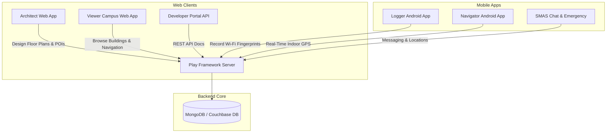

<div align="center">

# 📍 E-JUST Interactive Map & Anyplace Indoor Navigation System

### *An Advanced, GPS-Less Indoor Localization, Navigation & Mapping Platform for Smart Campuses*

[](clients/android-new/)
[](clients/android-new/)
[](server/)
[](clients/web/)
[](LICENSE.txt)

---

</div>

## 📌 Executive Overview

**E-JUST Interactive Map (powered by Anyplace)** is a comprehensive, open-source indoor positioning, navigation, and campus mapping system designed for smartphones and web browsers.

In indoor environments like university campuses, convention centers, and hospitals, satellite-based GPS signals are blocked by concrete walls and roofs. This platform solves the indoor navigation challenge by leveraging **crowdsourced Wi-Fi fingerprinting (RSSI)**, **inertial smartphone sensors (IMU)**, and **computer vision (CV)** to deliver accurate, real-time indoor positioning without requiring expensive specialized hardware.

---

## 🏗️ System Architecture

The project consists of three core layers working together seamlessly:



---

## 🚀 Core Components & Modules

### 1. 📱 Android Mobile Suite (`clients/android-new/`)
The native Android ecosystem is built in modern **Kotlin** with **Hilt Dependency Injection**, **Coroutines**, **Jetpack Datastore**, and **Retrofit2**.

* **`logger/` (Anyplace Logger App):**
  * **Surveying & Fingerprinting Tool:** Used by campus administrators and surveyors to walk floors, pin physical $(X, Y)$ locations on floor maps, and record Wi-Fi Access Point RSSI signals.
  * **Pre-built APK:** Available directly at [`apks/logger-debug.apk`](apks/logger-debug.apk).
* **`lib-android/` (Android Core Library):**
  * Shared UI components, preference fragments, Mapbox/Google Maps integration, object detection (TensorFlow Lite YOLO), and navigation algorithms.
* **`lib-core/` (Multiplatform Core Library):**
  * Pure Kotlin network models, Data Transfer Objects (DTOs), and base network response wrappers.

---

### 2. 🌐 Web Application Suite (`clients/web/`)
Built with modern web standards and AngularJS/HTML5:

* **[Architect](clients/web/anyplace_architect/):** An interactive CAD-like map editor allowing campus managers to:
  * Upload building CAD blueprints and floor plan images.
  * Set physical GPS anchor points and scales.
  * Draw indoor walls, hallways, corridors, and Points of Interest (POIs).
* **[Viewer / Viewer Campus](clients/web/anyplace_viewer_campus/):** Public web portal for students, staff, and visitors to search for rooms, view multi-floor maps, and compute indoor routes.
* **[Developers Portal](clients/web/developers/):** Interactive Swagger REST API documentation for backend integration.

---

### 3. ⚙️ Backend Server (`server/`)
* Built with **Scala** and the **Play Framework**.
* Connects to **Couchbase** and **MongoDB** databases.
* Exposes RESTful v4 API endpoints for building management, floor plan retrieval, Wi-Fi fingerprint processing, and spatial queries.

---

### 4. 🤖 Simulators & Specialized Clients
* **`clients/simulator/`:** Simulator tool for testing large-scale crowdsourced indoor location algorithms.
* **`clients/robotos/`:** Robot Operating System (ROS) integration module.
* **`clients/linux/`**, **`clients/macos/`**: Desktop clients.

---

## 🛠️ Build & Installation Guide (Android Logger App)

### 📋 Prerequisites
* **OS:** Linux (Ubuntu), macOS, or Windows
* **JDK:** OpenJDK 17 (`JAVA_HOME=/usr/lib/jvm/java-1.17.0-openjdk-amd64`)
* **Android SDK:** Platform 31 (Android 12), Build-Tools `30.0.3`

---

### 📥 1. Cloning the Repository
Always clone with submodules to pull `lib-android` and `lib-core`:

```bash
git clone --recurse-submodules https://github.com/mona585/E-JUST_interactive_Map.git
cd E-JUST_interactive_Map
```

If already cloned without submodules:
```bash
git submodule update --init --recursive
```

---

### 🔨 2. Building the Logger APK
Navigate to `clients/android-new` and compile with Gradle:

```bash
cd clients/android-new
export JAVA_HOME=/usr/lib/jvm/java-1.17.0-openjdk-amd64
./gradlew :logger:assembleDebug
```

> ⚡ **Automatic Build Artifact Copying:** The build script is configured to automatically copy the compiled debug APK directly to [`apks/logger-debug.apk`](apks/logger-debug.apk) upon successful build.

---

### 📲 3. Installing on Android Device
Connect your Android phone via USB with USB Debugging enabled, then run:

```bash
adb install -r logger/build/outputs/apk/debug/logger-debug.apk
```
*or directly from the repository output:*
```bash
adb install -r ../../apks/logger-debug.apk
```

---

## 🛠️ Server Setup (Docker)

You can launch the full backend server and Couchbase database locally using Docker Compose:

```bash
cd docker
docker-compose up -d
```

Access the backend service at `http://localhost:8080/api/v4/`.

---

## 🛠️ Recent Improvements & Stability Updates (Android 12–17)

The latest branch updates (`Mesbah_Branch_Test`) introduce key fixes for modern Android OS versions:

1. **Android 12 to 17 OS Compatibility:**
   * Canonicalized activity package definitions in `lib-android/src/main/AndroidManifest.xml` to prevent `ActivityNotFoundException`.
   * Registered `CvBackendLoginActivity` and `SmasLoginActivity` in the manifest.
2. **16 KB Page-Alignment Support (Android 14/15/16):**
   * Configured `useLegacyPackaging = true` for native JNI libraries (`libtensorflowlite_jni.so`, `libtensorflowlite_gpu_jni.so`) to pass APK alignment checks on devices with 16 KB memory pages.
3. **Settings Screen & Navigation Fixes:**
   * Replaced custom multi-arg Fragment constructors with zero-arg constructors required by Android `FragmentManager`.
   * Pointed Settings button on login screen to `SettingsAnyplaceServerActivity`.
4. **Network & Null Safety Hardening:**
   * Default-initialized `path` in `RetrofitHolderSmas` with `/smas/api`.
   * Added `init` blocks in Retrofit holders to safely instantiate base URLs.
   * Handled non-JSON / HTML HTTP errors safely in `SmasLoginViewModel` and `AnyplaceLoginViewModel` without throwing `NullPointerException`.

---

## 📚 Research Publications & Citations

If you use Anyplace or E-JUST Interactive Map in academic research, please cite:

1. **The Anyplace 4.0 IoT Localization Architecture**  
   *Paschalis Mpeis, Thierry Roussel, Manish Kumar, Constantinos Costa, Christos Laoudias, Denis Capot-Ray, Demetrios Zeinalipour-Yazti*  
   *Proceedings of the 21st IEEE International Conference on Mobile Data Management (MDM '20), 2020.*

2. **The Anatomy of the Anyplace Indoor Navigation Service**  
   *Demetrios Zeinalipour-Yazti and Christos Laoudias*  
   *ACM SIGSPATIAL Special (SIGSPATIAL '17), Vol. 9, pp. 3-10, 2017.*

3. **Internet-Based Indoor Navigation Services**  
   *Demetrios Zeinalipour-Yazti, Christos Laoudias, Kyriakos Georgiou, Georgios Chatzimilioudis*  
   *IEEE Internet Computing, vol. 21, no. 4, pp. 54-63, 2017.*

---

## 🤝 Contributing & License

* **License:** [MIT License](LICENSE.txt)
* **Contributions:** Pull requests are welcome! Please refer to [CONTRIBUTING.md](CONTRIBUTING.md) before submitting code changes.
