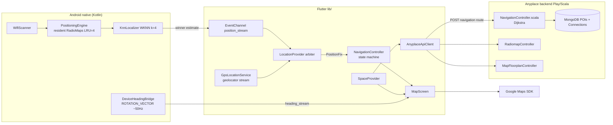
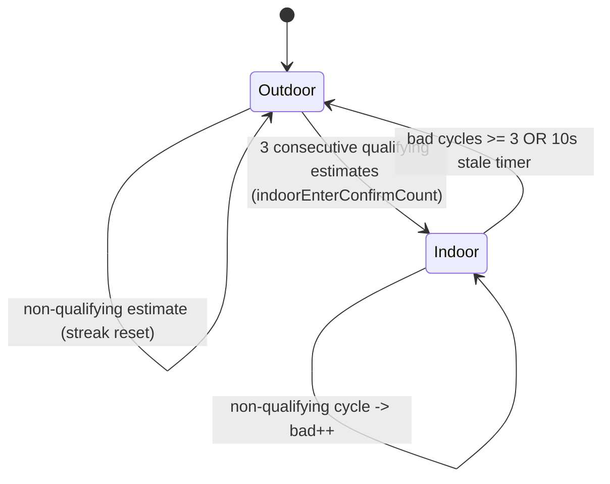
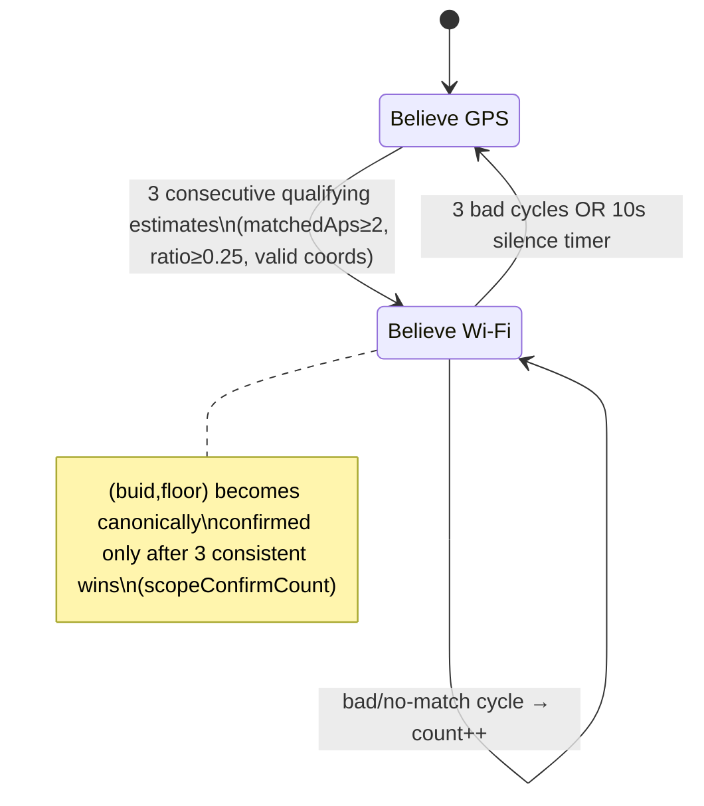
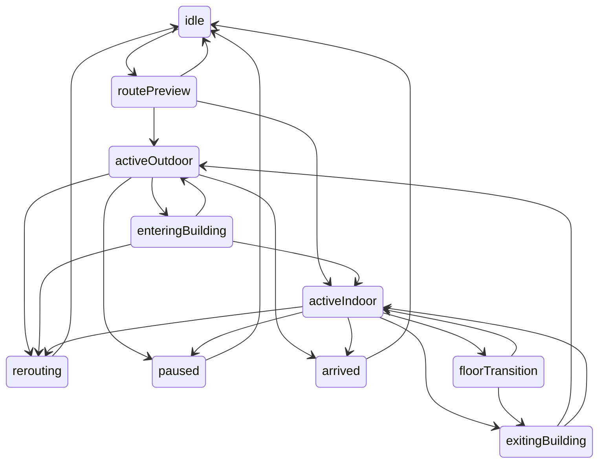

# Indoor Navigation System — Actual Implementation Reference

**Scope of truth:** this document describes what the current source code actually does
(Flutter client `clients/flutter/anyplace_campusfind`, Android native code under
`android/app/src/main/kotlin/`, and the Anyplace Play/Scala backend under `server/`).
Every file, class, method, endpoint and constant below was read from source. Where
documentation and code disagree, this document states the code's behavior.

**Backend in use:** `https://ap.cs.ucy.ac.cy:44` (`ApiConfig._defaultBaseUrl`,
overridable via `--dart-define=SERVER_URL`). This is the public UCY Anyplace server,
not a local E-JUST deployment.

---

## Table of Contents

1. [System Overview](#1-system-overview)
2. [How the User Starts Indoor Navigation](#2-how-the-user-starts-indoor-navigation)
3. [Indoor Positioning](#3-indoor-positioning)
4. [Radiomap](#4-radiomap)
5. [Floor Detection / Floor Management](#5-floor-detection--floor-management)
6. [Route Calculation](#6-route-calculation)
7. [Multi-Floor Navigation](#7-multi-floor-navigation)
8. [Map / Floorplan Rendering During Navigation](#8-map--floorplan-rendering-during-navigation)
9. [User Location Marker](#9-user-location-marker)
10. [Location Update Frequency](#10-location-update-frequency)
11. [GPS + Indoor Positioning](#11-gps--indoor-positioning)
12. [Navigation State Machine](#12-navigation-state-machine)
13. [Backend API Dependencies](#13-backend-api-dependencies)
14. [End-to-End Data Flow](#14-end-to-end-data-flow)
15. [Failure Cases](#15-failure-cases)
16. [Current Limitations / Unsupported Behavior](#16-current-limitations--unsupported-behavior)
17. [Exact File / Class Reference](#17-exact-file--class-reference)
18. [Complete Sequence Example](#18-complete-sequence-example)

---

## 1. System Overview

The application is a Flutter client backed by two native Android subsystems and the
public Anyplace UCY backend:

- **Positioning** is fully on-device: Wi-Fi scans are localized against resident
  radiomaps inside a Kotlin WKNN engine; nothing about indoor position goes to or
  comes from the network at fix time. Only the radiomap *files* are downloaded once
  (and cached) from the backend.
- **Routing** is fully server-side: the backend builds a Dijkstra graph per request
  from MongoDB POI + Connection documents.
- **Arbitration** between outdoor GPS and indoor Wi-Fi happens in Dart
  (`LocationProvider`) using measurement evidence only — UI selection never decides
  which source is believed.

```
User
 → Flutter UI            MapScreen / MapBottomSheet / PoiDetailCard / NavigationStatusBar / ArrivalBanner
 → Controllers           SpaceProvider · LocationProvider · NavigationController (ChangeNotifiers via provider)
 → Positioning           GPS: geolocator stream ─┐
                         Wi-Fi: WifiScanner → KnnLocalizer (Kotlin) → EventChannel ─┤→ LocationProvider arbiter → PositionFix
                         Compass: DeviceHeadingBridge (TYPE_ROTATION_VECTOR) → MapScreen heading
 → Backend (HTTP)        spaces · floors · POIs · radiomaps · floorplans64 · navigation/route[·/coordinates]
 → Route model           NavigationRouteModel (+ optional RouteSegment list) → polylines on GoogleMap
 → Rendering             GroundOverlay floorplan (LRU bitmap cache) + Polyline route + user marker + camera follow
```



---

## 2. How the User Starts Indoor Navigation

### 2.1 App wiring (startup)

| Step | File | What happens |
|---|---|---|
| Provider construction | `lib/main.dart` | Singletons created: `LocationProvider()` (which immediately subscribes to the native estimate stream), `SpaceProvider(...)`, then `NavigationController(spaceProvider:, locationProvider:)`. All exposed through `MultiProvider`. |
| Bridge registration | `MainActivity.kt` → `configureFlutterEngine` | Instantiates `PositioningBridge(messenger, applicationContext)` (registers both platform channels) and `DeviceHeadingBridge` on `EventChannel("eg.edu.ejust.anyplace_campusfind/heading_stream")`. |
| First screen | `lib/ui/screens/map_screen.dart` → `_MapScreenState.initState` | Generates marker icons; subscribes `_deviceHeadingService.headingStream`; post-frame callback binds `spaceProvider.setLocationProvider(locationProvider)` and calls `locationProvider.requestAndCenter()`. |

### 2.2 Opening the map / first location

1. `LocationProvider.requestAndCenter()` (`lib/state/location_provider.dart:606`)
   - Checks location service enabled → requests permission (`GpsLocationService.requestPermission`)
   - `getCurrentPosition()` for an initial fix
   - `startTracking()` subscribes `getPositionStream(distanceFilter: 0.3)`
   - Status becomes `tracking`; every GPS update runs `_evaluateArbitration()` producing canonical `currentFix`.
2. Spaces load independently (`MainShell` triggers `loadSpaces()` → `POST /api/mapping/space/public`).

### 2.3 Selecting building → floor → destination → Start Directions

| # | User action | Call chain (verified entry points) |
|---|---|---|
| 1 | Tap building marker/card | `MapScreen._onBuildingTapped` → `SpaceProvider.selectSpace(space)` (space_provider.dart:428). Resets radio-map state, loads floors (`loadFloorsForSelectedSpace`), camera animates to the building. |
| 2 | Tap floor | `SpaceProvider.selectFloor(floor)` (:476). Guards identical selection; sets `_selectedFloor`; fires three acquisitions: `loadRadioMapForSelectedFloor()` (:1612), `loadFloorplanForSelectedFloor()` (:1720), `loadPoisForSelectedFloor()` (:1828). |
| 3 | Tap POI | `SpaceProvider.selectPoi(poi)` (:526); bottom sheet shows `PoiDetailCard`. |
| 4 | "Navigate" button | `PoiDetailCard.onNavigate` → `SpaceProvider.requestRouteToSelectedPoi()` (:653) — cascade described in §6. Route lands in `activeNavigationRoute`. |
| 5 | "Start Directions" | `PoiDetailCard.onStartDirections` (map_bottom_sheet.dart:209): `navController.startRoutePreview(destinationPuid:, destinationSpace:, destinationFloorNumber:)`, then `navController.startActiveNavigation()`, then `widget.onFitRouteBounds?.call(spaceProvider)` frames the route. |

**`startRoutePreview`** (`lib/state/navigation_controller.dart:322`):
- Requires state `idle`/`routePreview` and `scope.activeNavigationRoute.hasRenderablePath`.
- Seeds `_destinationPuid`, `_destinationSpace`, `_activeRoute`,
  `_currentNavigatingFloor = scope.selectedFloor.floorNumber`; resets transition/arrival
  counters; resolves arrival anchor (`_resolveArrivalAnchor`: destination POI if present
  in scope POIs, else last route point).
- Transitions `idle → routePreview`.

**`startActiveNavigation`** (`navigation_controller.dart:362`):
- Valid only from `routePreview`.
- Initial activity chosen **purely by positioning evidence**: `fix?.source == wifi` →
  `activeIndoor`, otherwise `activeOutdoor`.

---

## 3. Indoor Positioning

Indoor positioning = **on-device Wi-Fi fingerprinting (WKNN) against locally stored
radiomaps**, gated by a Dart-side evidence arbiter. GPS plays no role in producing an
indoor coordinate; sensors play no role either (compass affects only displayed
heading/camera bearing).

### 3.1 Native scan → estimate pipeline (Kotlin)

| Stage | File | Class/Object | Method | Behavior |
|---|---|---|---|---|
| Scan trigger | `positioning/WifiScanner.kt` | `WifiScanner` | receiver on `WifiManager.SCAN_RESULTS_AVAILABLE_ACTION` | Event-driven: reacts to any system scan completion (not subject to this app's own throttle quota). Lazy fallback calls `startScan()` only after **10 s** without results (`FALLBACK_RETRIGGER_MS = 10_000`). On start, processes cached system results immediately ("instant first fix"). Stops itself when no resident maps exist. |
| Scan collection | same | `handleScanResults` | reads `wifiManager.scanResults` | Maps to `ScanRecord(bssid, level=rssi)`; skips empty BSSIDs. |
| Localization dispatch | `positioning/PositioningEngine.kt` | `PositioningEngine` object | `processScanResults(scanResults)` | Localizes one scan against **every resident map** (max **4**, access-ordered LRU, key `"buid|floor"`). Winner = highest `matchedAps`; ties broken by lowest RSS-space `bestDistance`. Emits exactly one `NativePositionEstimate` per scan (`status="success"` or `"no_match"` with null coords/empty identity). Measurement-only winner choice — routes/UI never influence it. |
| WKNN math | `positioning/KnnLocalizer.kt` | `KnnLocalizer` | `localize(scanResults, radioMap, k=4, weighted=true)` | Observed RSS vector over the map's MAC list (missing APs = `nanValue`, default −110). Per fingerprint: Euclidean distance over shared MAC space. **k=4 nearest fingerprints**, inverse-distance weighted average of lat/lon (zero-distance weight = 1000). Also reports `bestDistance` and `topKSpreadMeters` (max pairwise great-circle spread of the k picks). |
| Estimate delivery | `positioning/PositioningBridge.kt` | `engineListener` | `onPositionEstimated` | Posts `{latitude, longitude, buid, floor, matchedAps, totalAps, durationMs, timestamp, status, bestDistance, topKSpreadMeters}` into `EventChannel("eg.edu.ejust.anyplace_campusfind/position_stream")`. |

### 3.2 Radiomap residency (what makes localization possible)

- Loading is driven exclusively by **UI floor selection** (§4): successful
  `loadRadioMap` upserts a parsed `RadioMap` keyed `"buid|floor"`, refreshes LRU
  recency, evicts beyond 4 residents, starts scanning.
- `removeRadioMap(buid,floor)` / `clearRadioMap()` stop scanning only when the
  resident set becomes empty (bridge enforces this).
- **No resident map ⇒ no estimates at all**: `handleScanResults` early-returns and the
  fallback loop stops (`WifiScanner.kt:59,125`).

### 3.3 Dart arbitration (`LocationProvider`)

File: `lib/state/location_provider.dart`. Raw streams are pass-through
(`gpsLocation`, `latestIndoorEstimate`); user-visible position comes only from the
canonical `currentFix` (type `PositionFix`, `lib/data/models/position_fix.dart`).

**Qualification gate** `_qualifies(e)` (:245): `e.isValid` (status `success`, finite
non-null coords ≠ (0,0), matchedAps>0) AND non-empty `buid`+`floor` AND
`matchedAps ≥ NavigationConfig.stabilityMinMatchedAps (2)` AND, when totalAps>0,
`matchedAps/totalAps ≥ NavigationConfig.minMatchedRatio (0.25)`.

**Mode machine** (exactly one believed source; no numerical fusion):



- **Accept path** `_acceptWifiEstimate` (:347): builds `PositionFix(source: wifi,
  accuracy: clamp(max(topKSpreadMeters, bestDistance), 2..30 m), confidence:
  0.45·ratioScore + 0.25·spreadScore + 0.30·stabilityScore, status: fresh)`.
- **Scope confirmation** `_advanceClaim` (:382): `(buid,floor)` becomes canonically
  confirmed (`confirmedBuid/_confirmedFloor`) only after
  `NavigationConfig.scopeConfirmCount = 3` consecutive consistent accepted estimates.
  Until confirmed `fix.hasScope == false` — identity is never taken from a lone
  estimate nor from UI context.
- **Outlier guard** `_isOutlierJump` (:330): applies only when the estimate claims the
  *same* resident-map identity as the last accepted fix; different `(buid,floor)`
  bypasses it (floors overlap geographically). Threshold
  `outlierJumpThresholdMeters = 30`.
- **Stale timer** `_scheduleIndoorStaleTimer` (:498): no fresh valid estimate within
  `indoorStaleTimerSeconds = 10` ⇒ clears estimate and exits indoor mode; GPS falls
  back automatically in `_evaluateArbitration` (:474).
- **Exit hysteresis:** `indoorExitStaleCycles = 3` consecutive bad/outlier cycles.
- **Stability tracker** `_evaluateStability` (:554): rolling window
  `stabilityWindowSeconds = 5`; stable requires ≥ `stabilityMinEstimates (3)` entries,
  all `matchedAps ≥ 2`, consecutive deltas ≤ `stabilityMaxDelta (15 m)`; else
  `acquiring`; none ⇒ `unavailable`.

**Checklist answers grounded in code:**

- *Frequency:* per system Wi-Fi scan event (no fixed period promised anywhere);
  guaranteed self re-trigger attempt every 10 s while maps are resident.
- *On failure:* invalid/no-match estimates are bad cycles; after 3 bad cycles or 10 s
  silence the arbiter exits indoor mode and GPS (or nothing) is believed.
- *No radiomap:* zero residents ⇒ engine emits nothing ⇒ arbiter stays outdoor ⇒
  marker follows GPS only.
- *Without manually selecting a floor:* positioning works only if that floor's
  radiomap is already resident from earlier in the session. Cold app = zero residents;
  some floor must be selected (manually, or auto-selected during navigation entry,
  §5/§12) before any indoor fix can exist. UI selects *which maps load*; it never
  decides *which map wins*.

---

## 4. Radiomap

**What it is here:** the Anyplace mean-RSS plaintext fingerprint file per
`(buid, floor)` — training data for the on-device WKNN localizer.

**Format** (parsed by `positioning/RadioMap.kt`; produced server-side by
`server/app/modules/radiomapserver/RadioMapMean.scala`):

```
Line 1:   # NaN -110                                NaN fill value
Line 2:   # X, Y, HEADING, <mac1>, <mac2>, ...      header + MAC list
Line 3+:  <lat>, <lon>, <heading>, <rss1>, ...      one row per fingerprint
```

- Coordinates are WGS84; missing RSSI values are filled with `nanValue` (−110 default).
- Parsed into `macAddressList`, `locationRssMap: HashMap<"lat lon", List<Double>>`,
  `orderList`. Rejected when 0 APs or 0 fingerprints.

**Acquisition chain** (triggered by `selectFloor`):

1. `SpaceProvider.loadRadioMapForSelectedFloor({forceReload})` (space_provider.dart:1612):
   bumps `_radioMapRequestId`, sets `RadioMapStatus.loading`, checks cache flag.
2. `AnyplaceRadioMapRepository.getRadioMap(buid, floor)`
   (`lib/data/repositories/radiomap_repository.dart`) — **cache-first** via
   `RadioMapCache.getRadioMap`: `<appSupport>/radiomaps/<buid>/<floor>/indoor-radiomap-mean.txt`
   (`lib/data/datasources/radiomap_cache.dart`). On miss:
3. `AnyplaceApiClient.fetchRadioMapMetadata` → `POST /api/radiomap/space`
   body `{"buid","floor"}` → JSON must contain `map_url_mean`.
4. `fetchRadioMapRaw` → `POST /api/radiomaps_frozen/{buid}/{floor}/indoor-radiomap-mean.txt`
   body `{}` → plaintext (filename constant
   `ApiConfig.defaultRadiomapMeanFilename = 'indoor-radiomap-mean.txt'`). Empty or
   error-shaped payloads rejected.
5. Cache write, then `_nativePositioningService.loadRadioMap(text, buid, floor)` →
   MethodChannel method `loadRadioMap` → `PositioningEngine.loadRadioMapText`
   (parse-validate-upsert; scanning starts on success).

**Lifecycle / eviction:** native residency max 4 maps, access-ordered LRU
(`RESIDENT_MAP_LIMIT = 4`, PositioningEngine.kt:36). Dart mirror
`NavigationConfig.residentMapLimit = 4` is documentation-only (its own comment says the
native constant is authoritative). Disk cache persists across sessions.
`_resetRadioMapState` (space_provider.dart:1898) calls native `clearRadioMap()`
whenever the selected *building* changes or selection clears — changing buildings
empties residency; changing floors within a building keeps prior floors' maps resident
(LRU-bounded at 4).

**Missing data behavior:** backend says none exists → `radioMapStatus = unsupported`
("No RadioMap available for this floor."); HTTP/parse errors → `error`. On native
rejection the provider removes that map (`removeRadioMap`) so stale text never
lingers. No radiomap ⇒ no qualifying estimates ⇒ arbiter remains GPS-believed.

---

## 5. Floor Detection / Floor Management

**Manual floor selection** is the primary mechanism: `SpaceProvider.selectFloor`
loads floorplan + radiomap + POIs and repaints the map.

**Automatic floor detection** exists only as positioning evidence: each winning
estimate carries `(buid, floor)` of the radiomap it matched. The arbiter confirms
identity after 3 consistent wins (`scopeConfirmCount`) exposing `fix.floor`.
Outside an active navigation session nothing acts on this evidence — there is no
idle-time auto-switching of the viewed floor.

**During active navigation** evidence drives real switching (FLOOR_TRANSITION flow,
§7/§12): connector-proximity pre-selection (30 m), evidence confirmation
(`stabilityMinEstimates = 3` consistent divergent ticks), scope switch via
`_completeFloorTransition` calling `_spaceScope.selectFloor(newFloorModel)` (loads new
floorplan/radiomap/POIs), post-switch reroute suppression
(`postFloorSwitchSuppressSeconds = 10`).

**Route vs manual floor change mid-session:** the route object is NOT cleared.
Off-route detection measures deviation only against
`route.polylinePointsForFloor(_currentNavigatingFloor)` where
`_currentNavigatingFloor` is controller bookkeeping set during the session (preview /
entrance preload / transitions), not by idle manual taps. Arrival indoors additionally
requires confirmed fix identity matching the destination building+floor, so manual
selection cannot fake arrival.

**Explicitly NOT supported:** idle automatic view switching to detected floor;
cross-building routes on the server (hard-rejected, §6).
---

## 6. Route Calculation

### 6.1 Client-side orchestration

Entry point: **`SpaceProvider.requestRouteToSelectedPoi()`** (`lib/state/space_provider.dart:653`),
invoked when the user taps *Navigate* on a selected POI. The method runs a guarded
cascade (each stage checks `_routeRequestId` so a newer request supersedes an older
in-flight one):

| Stage | Condition | Mechanism |
|---|---|---|
| 0 | Destination is in a **different building** than the user's believed/current building | `_detectBuildingFromPolygon` (point-in-polygon over space polygons) → `CrossBuildingRouter.composeRoute` stitches legs client-side (server refuses cross-building, §6.2). |
| 1 | User's position is usable | **Coordinate route**: `POST /api/navigation/route/coordinates` with `{coordinates_lat, coordinates_lon, floor_number, pois_to}` — server snaps the origin to the nearest POI of that floor. |
| 2 | Coordinate route failed/unavailable but POIs are loaded on the current floor | **Nearest-POI route**: pick the loaded-floor POI nearest the user, then `POST /api/navigation/route` with `{pois_from, pois_to}` (POI-to-POI). |
| 3 | Both server strategies failed | **Hybrid fallback** (custom-route pipeline): outdoor leg from OSRM (`fetchOutdoorWalkingRoute`) or cached KMZ geometry + entrance→destination indoor leg stitched through connector POIs (`poisType == 'None'`, e.g. doors/stairs/elevators). Thresholds `customRouteOnThreshold 30 m`, `customRouteSnapThreshold 50 m`, `customRouteConnectionThreshold 100 m` gate stitching quality. |

Results land as a `NavigationRouteModel` in `activeNavigationRoute` with status
`ready` / `partial` (usable but incomplete, e.g. fallback-stitched) / `error`.
Recent successful requests are memoized in a small waypoint cache to avoid refetches.

### 6.2 Server-side graph routing (the real path engine)

File: `server/app/controllers/NavigationController.scala` (+ `Dijkstra.scala`,
`NavResultPoint.scala`). Routes wired in `server/conf/api.routes`.

**`POST /api/navigation/route`** (`getNavigationRoute`, body `pois_from` + `pois_to`):

| Origin vs destination | Graph built | Result |
|---|---|---|
| Same building, same floor | `navigateSameFloor`: vertices = that floor's POIs, edges = Connection documents touching them | Dijkstra over floor graph |
| Same building, different floors | `navigateSameBuilding`: vertices = **all POIs of the building**, edges = **all Connection documents of the building** (this is how stairs/elevator connectors produce multi-floor paths) | Dijkstra over whole-building graph |
| Different buildings | none | Hard failure: *"Navigation between buildings not supported yet."* |

**`POST /api/navigation/route/coordinates`** (`getNavigationRouteXY`, body
`coordinates_lat, coordinates_lon, floor_number, pois_to`):
- Snaps the free coordinate to the **nearest POI** on the given `(buid, floor)`; empty
  floor ⇒ *"Navigation is not supported on your floor."*
- Rejects origins ≥ **5000 m** from the destination (`ROUTE_MAX_DISTANCE_ALLOWED = 5.0`).

**Dijkstra** (`server/app/modules/navigation/Dijkstra.scala`): vertices keyed by POI
`puid`; edges materialized from MongoDB `Connection` documents (`pois_a` ↔ `pois_b`,
optional weight field); standard relaxation `dv.minDistance + e.weight` (line 154);
path reconstruction `getShortestPath` (line 177). Response shape:
`{"num_of_pois": N, "pois": [ {...}, ... ]}` — an ordered list of
`NavResultPoint`s (lat/lon/puid/buid/floor/pois_type/is_outdoor).

### 6.3 Route model on the client

`lib/data/models/navigation_route_model.dart` + `route_segment.dart`:
- `NavigationRoutePoint {latitude, longitude, puid, buid, floorNumber, poisType, isOutdoor}`
- `RouteModelStatus {ready, partial, error}`
- Segments typed `RouteSegmentType {outdoorWalking, indoorRouting, floorTransition, entranceTransition, exitTransition}` — each segment carries points/floor/building/connector id/instruction/distance and flags `isIncomplete` / `isFallbackLocation`. Segment metadata drives per-segment polyline styling (§8).

### 6.4 Outdoor walking legs

`AnyplaceApiClient.fetchOutdoorWalkingRoute` calls the **public demo OSRM instance**
(`http://router.project-osrm.org/route/v1/foot/{lon},{lat};{lon},{lat}?overview=full&geometries=geojson`)
— plain HTTP, third-party, used only inside the hybrid fallback path.

---

## 7. Multi-Floor Navigation

Multi-floor behavior exists **within one building only** and is driven by positioning
evidence against connector POIs (stairs/elevators modeled as `Connection` endpoints).

```mermaid
sequenceDiagram
    participant U as User (walking)
    participant NC as NavigationController
    participant LP as LocationProvider
    participant SP as SpaceProvider
    U->>LP: Wi-Fi estimates (floor A)
    NC->>NC: fix within 30 m of floor-A connector (connectorProximityThreshold)
    NC->>NC: FLOOR_TRANSITION detected (event DETECTED/EXPECTED)
    Note over NC: expects next floor from route segments
    LP-->>NC: estimates now claim floor B (divergent ticks)
    NC->>NC: ≥3 consistent divergent ticks (stabilityMinEstimates) → CONFIRMED
    NC->>SP: selectFloor(floorB) — loads floorplan + radiomap + POIs
    SP->>SP: native loadRadioMap(floorB) (LRU ≤4 residents)
    NC->>NC: postFloorSwitchSuppressSeconds = 10 (no reroute churn)
    NC->>NC: activeIndoor on floor B; reroutes measured vs floor-B polyline
```

Verified mechanics:

- **Pre-selection:** entering `connectorProximityThreshold = 30 m` of the connector on
  the current floor triggers the transition state; the expected next floor comes from
  route segment metadata, never guessed.
- **Confirmation is evidence-only:** the switch executes after
  `stabilityMinEstimates = 3` consecutive consistent estimates claiming the new floor.
  Aborts emit `ABORTED` events. Transition history ring keeps the last 8 events
  (`lib/data/models/floor_transition_event.dart`).
- **Floor asset swap:** confirmation calls the same `selectFloor` path as manual taps,
  so the new floor's floorplan/radiomap/POIs all load; old maps stay resident (LRU ≤4)
  enabling bounce-back detection.
- **Visual continuity:** during `floorTransition` the UI shows the held last position
  (`displayLocationFor` / `heldPositionDuringTransition`) and the status bar blacks out
  coordinates with *"Moving to Floor N…"* instead of showing contradictory data.
- **Route persistence:** the route object survives manual floor changes mid-session;
  off-route deviation is always computed against
  `route.polylinePointsForFloor(_currentNavigatingFloor)` — controller bookkeeping set
  by the session (preview/entrance preload/transitions), not by idle taps.
- Arrival indoors additionally requires confirmed fix identity matching destination
  building+floor, so manually viewing another floor cannot fake arrival.

---

## 8. Map / Floorplan Rendering During Navigation

Rendering stack (all inside `MapScreen` + helpers):

| Layer | Implementation |
|---|---|
| Base map | Google Maps SDK (`google_maps_flutter`), normal/light style. |
| Floorplan image | `GroundOverlay` per selected floor, managed by `_syncFloorplanOverlay(spaceProvider)` — single-owner lifecycle replacing ad-hoc bitmap work. Bitmaps come from an **LRU cache** (`lib/ui/utils/floorplan_overlay_cache.dart`, key `buid|floor`, bounded entries, disposed bitmaps evicted). |
| Floorplan source | `FloorplanRepository.getFloorplan` (**cache-first**: memory flag → disk `<appSupport>/files/floorplans/<buid>/<floor>/floorplan.png` + `metadata.json`; network only on miss). Network fetch `GET /api/floorplans64/{buid}/{floor}` with dedicated long timeout `ApiConfig.floorplanImageTimeout = 5 min` (UCY server trickles ~70 KB/s for ~8 MB PNGs — measured; the previous 30 s default made cold loads impossible). |
| Camera centering on floorplan | `_checkFloorplanCameraCenter` (map_screen.dart:653) fits the camera to floorplan bounds when appropriate (e.g., first show of a floor). |
| Route polylines | `_buildPolylines` (map_screen.dart:820). Two generations exist: **segmented styling by `RouteSegmentType`** when segment metadata is present; legacy styles otherwise (dotted blue = outdoor, solid red = indoor). The custom-KMZ fallback path renders white outline (~12 px) + gray core (~6 px). |
| User marker | See §9. |
| Status chrome | `NavigationStatusBar` + `ArrivalBanner` widgets driven by `NavigationController` snapshots. |

Floorplan lifecycle guarantees added by this repo's recent fix commit (`2856a4b7`):
overlay sync is request-scoped, bitmaps are recycled through the LRU cache, and
dispose guards prevent use-after-dispose jank/black-screen when switching floors or
exiting the screen quickly.

---

## 9. User Location Marker

- Marker position = canonical `currentFix` from the arbiter (GPS-believed or
  Wi-Fi-believed — one marker, source-tagged icon), never raw stream values.
- During `floorTransition` the displayed location is the held pre-transition fix
  (`displayLocationFor`), preventing teleporting markers.
- Heading arrow rotation uses a dedicated `ValueListenable` (`_markerHeadingNotifier`)
  so compass updates repaint **only the marker layer**, not the whole map subtree
  (map_screen.dart builds the marker from a `ValueListenableBuilder`).
- Compass/movement heading logic feeding that notifier is described in §10.

## 10. Location Update Frequency

| Signal | Producer cadence (measured from code) |
|---|---|
| GPS fixes | `GpsLocationService.getPositionStream(distanceFilter: 0.3)` — geolocator rounds values `<1 m` down to 0 ⇒ effectively **every platform update**; `AndroidSettings(accuracy: high)`. |
| Wi-Fi estimates | One estimate **per system Wi-Fi scan completion event** (no fixed period promised); scanner self-retriggers `startScan()` only after **10 s** without results while radiomaps are resident. |
| Heading | Rotation-vector sensor at `SENSOR_DELAY_GAME` (~50 Hz) natively; Dart-side EMA smoothing α = 0.6 and UI rate limit **200 ms** (`bearingUpdateIntervalMs`); compass value trusted ≤2000 ms freshness, else movement bearing (speed > 0.2 m/s AND moved > 0.15 m). |
| Camera follow | Gated: moves only when user moved ≥ **0.3 m** or bearing changed ≥ **1.5°** (`cameraMoveThresholdMeters`, `cameraBearingThresholdDegrees`); animations coalesced; zoom 19 indoor / 17 outdoor, anchor lower-third (0.67). Manual pan exits follow mode. |

## 11. GPS + Indoor Positioning

The system runs **one arbiter, two sources, zero numeric fusion**
(`lib/state/location_provider.dart`):



Key interaction rules:

- **Outdoor → indoor handover** requires the qualification gate passed three times in
  a row (`indoorEnterConfirmCount = 3`) — a single lucky scan cannot hijack the marker.
- **Indoor → outdoor fallback** is automatic and fast (3 bad cycles or 10 s stale
  timer); GPS was streaming all along, so nothing needs restarting.
- **Identity is never taken from UI context**: `fix.buildingId/floor` populate only via
  the 3-consistent-wins scope confirmation; `fix.hasScope == false` until then.
- **Stability reporting** (`PositioningStability`): rolling 5 s window, ≥3 estimates,
  matchedAps ≥ 2 each, consecutive deltas ≤ 15 m ⇒ `stable`; else `acquiring`;
  no window data ⇒ `unavailable`.
- GPS plays **no role** in producing indoor coordinates; it is purely the fallback
  belief and the exit signal.

---

## 12. Navigation State Machine

Canonical machine: `lib/state/navigation_state_model.dart` (states + static
transition table) enforced by `NavigationController._transition`
(`navigation_controller.dart`, which additionally allows the dynamic edges noted
below). The state describes *where the user is relative to the planned route*; it
never fabricates physical location — identity always comes from `PositionFix`.

### 12.1 States

| State | Meaning |
|---|---|
| `idle` | No session. |
| `routePreview` | Route rendered, directions not started (`startRoutePreview`). |
| `activeOutdoor` | Navigating; arbiter believes GPS. |
| `enteringBuilding` | Entry flow: entrance-proximity or Wi-Fi belief while outdoors; awaits indoor corroboration. Never entered from destination selection. |
| `activeIndoor` | Navigating; arbiter believes Wi-Fi. |
| `floorTransition` | Floor change in progress (connector approached / floor evidence diverging); awaits confirmation of new floor. |
| `exitingBuilding` | GPS believed and accumulating outside-building confirmation. |
| `arrived` | Destination reached with arrival evidence (`arrivalProximityThresholdMeters = 15` + identity match indoors). |
| `paused` | Temporarily halted (e.g., positioning loss); resumes to `previousActiveState`. |
| `rerouting` | Recomputing route; returns to `previousActiveState` on success/failure. |

### 12.2 Allowed transitions (static table, verbatim)



Dynamic edges added by the controller beyond the table:
- `paused`/`rerouting` → `previousActiveState` (resume/restore);
- user-initiated End ⇒ `idle` from **every** state
  (`isAllowedNavigationTransition` special-cases `to == idle`).

### 12.3 Legacy representation still present

`NavigationController` also carries `enum NavigationPhase {idle, preview, active}` and
`enum NavigationSubState {outdoor, indoor, transitioning}` for compatibility with
older call sites; the canonical snapshot is authoritative.

### 12.4 Off-route detection & rerouting

- Deviation measured per fix against `route.polylinePointsForFloor(_currentNavigatingFloor)`
  via `_computeMinDeviation`.
- Exceeding `deviationThreshold = 15 m` triggers reroute, throttled by
  `rerouteCooldownSeconds = 15`, capped at `rerouteMaxRetries = 3`, with exponential
  backoff 1 s → 2 s → 4 s between attempts; state passes through `rerouting` and
  restores `previousActiveState` afterwards.
- After a confirmed floor switch, reroute evaluation is suppressed for
  `postFloorSwitchSuppressSeconds = 10` to avoid churn while radiomaps settle.

## 13. Backend API Dependencies

Base URL: `ApiConfig.baseUrl = https://ap.cs.ucy.ac.cy:44` (public UCY Anyplace
server; override via `--dart-define=SERVER_URL`). Request timeout 30 s except
floorplan images (5 min).

| Endpoint (api_config.dart) | Method / body | Consumer | Purpose |
|---|---|---|---|
| `/api/mapping/space/public` | POST `{}` | `fetchSpaces` | All public buildings (Campus list). |
| `/api/mapping/space/get` | POST `{buid}` | `fetchSpaceById` | Single building detail. |
| `/api/mapping/floor/all` | POST `{buid}` | `fetchFloors` | Floors of a building (`floor_number`, `max_floor`, bounds). |
| `/api/mapping/pois/floor/all` | POST `{buid, floor}` | `fetchPoisForFloor` | POIs incl. connectors (`poisType 'None'`). |
| `/api/radiomap/space` | POST `{buid, floor}` | `fetchRadioMapMetadata` | Returns `map_url_mean`. |
| `/api/radiomaps_frozen/{buid}/{floor}/{filename}` | POST `{}` (filename = `indoor-radiomap-mean.txt`) | `fetchRadioMapRaw` | Plaintext fingerprint file → native localizer. |
| `/api/floorplans64/{buid}/{floor}` | GET (binary PNG, 5-min timeout) | `FloorplanRepository` | Floorplan image. |
| `/api/navigation/route` | POST `{pois_from, pois_to}` | `fetchNavigationRoute` | POI-to-POI Dijkstra route. |
| `/api/navigation/route/coordinates` | POST `{coordinates_lat, coordinates_lon, floor_number, pois_to}` | `fetchNavigationRouteFromCoordinates` | Coordinate-snapped Dijkstra route. |
| `http://router.project-osrm.org/route/v1/foot/...` | GET | `fetchOutdoorWalkingRoute` | Third-party outdoor leg (hybrid fallback only). |

Backend handlers: `NavigationController.scala` (`getNavigationRoute`,
`getNavigationRouteXY`), graph engine `Dijkstra.scala`, models `NavResultPoint.scala`;
route wiring in `server/conf/api.routes`. Mongo collections used at request time:
spaces, floors, pois, connections.

**Server-side constraints that shape client behavior:** cross-building routes are
rejected ("Navigation between buildings not supported yet."); coordinate origins ≥5 km
rejected; empty floors rejected ("Navigation is not supported on your floor."). The
client's cross-building composer and hybrid fallback exist precisely because of these.

## 14. End-to-End Data Flow

Numbered lifecycle of one full navigation session:

1. **App start**: providers wired (`main.dart`); native bridges registered
   (`MainActivity.kt` → `PositioningBridge`, heading EventChannel); GPS tracking starts
   after permission (`LocationProvider.requestAndCenter`).
2. **Campus load**: `POST space/public` → buildings listed; polygons cached for
   point-in-polygon building detection.
3. **Select building** (`selectSpace`) → floors fetched; radio-map state reset;
   native `clearRadioMap()` (building change empties residency).
4. **Select floor** (`selectFloor`) → three parallel acquisitions: floorplan
   (cache-first, LRU overlay), radiomap (cache-first disk → network → native
   `loadRadioMap`; scanning starts), POIs.
5. **Select POI → Navigate** (`requestRouteToSelectedPoi`) → strategy cascade §6.1 →
   server Dijkstra §6.2 → route rendered (preview).
6. **Start Directions** → `startRoutePreview` + `startActiveNavigation`; initial belief
   from current fix source.
7. **Walk loop**: every scan → WKNN estimate → qualification gate → arbiter accepts /
   holds / counts-bad → canonical `PositionFix` → deviation check vs current-floor
   polyline → camera follow + marker update; heading stream rotates arrow.
8. **Floor change**: connector proximity → `floorTransition` → evidence confirm ×3 →
   `selectFloor(new)` reloads assets → suppression window → continue on new polyline.
9. **Arrival**: distance ≤15 m of arrival anchor (+ indoor identity match) →
   `arrived` → banner; End → `idle`.

## 15. Failure Cases

| Failure | Observed code behavior |
|---|---|
| Location permission denied | Tracking never starts; status not `tracking`; no fixes; UI cannot navigate. |
| Location services off | `requestAndCenter` bails before requesting permission. |
| No radiomap resident | Engine emits nothing; arbiter stays GPS-believed; indoor mode unreachable. |
| Wi-Fi off / scans empty | Same as above; fallback retrigger loop stops when maps empty. |
| Radiomap file corrupt/empty | Repository rejects payload before native load; status `error`; map not loaded. |
| Native rejects radiomap | Provider calls `removeRadioMap` so stale text can't linger. |
| Floor has no POIs | Server coordinate-route answers "not supported on your floor"; cascade falls through to hybrid. |
| Cross-building destination | Server hard-rejects; client pre-detects and composes legs locally (`CrossBuildingRouter`). |
| Route fetch timeout/network error | Status `error`; recent-waypoint cache may satisfy repeats; user retries. |
| User drifts >15 m off route | Reroute attempt (cooldown 15 s, max 3 retries, backoff 1/2/4 s). |
| Positioning loss mid-session | Arbiter exits indoor after 10 s silence; controller may enter `paused`; resumes to previous active state. |
| Floorplan image slow/unreachable | Cache-first disk path serves instantly on revisit; cold loads tolerate up to 5 min before failing. |
| >4 floors visited | Oldest radiomap evicted natively (LRU 4); revisiting requires re-selection/reload. |

## 16. Current Limitations / Unsupported Behavior

Documented *as implemented* — these are facts about the code, not defects:

- **Cross-building routing unsupported server-side**; only client-side composition
  covers it.
- **No idle auto floor-switching**: outside an active session, detected-floor evidence
  never changes the viewed floor; some floor must be selected (manually or by the
  session) before its radiomap exists.
- **Max 4 resident radiomaps**; larger simultaneous coverage needs eviction cycles.
- **Public UCY server dependency** for spaces/floors/POIs/routes/floorplans/radiomaps,
  plus **public demo OSRM over plain HTTP** for fallback outdoor legs — both external
  availability risks; E-JUST self-hosting is not wired into this client build.
- **No sensor fusion for position**: inertial sensors unused; compass affects heading/
  camera bearing only.
- **Arrival indoors requires confirmed scope identity** matching the destination —
  manual floor taps can't spoof it, but it also means arrival won't fire if scope
  confirmation lags near the goal.
- **Legacy dual enums** (`NavigationPhase`/`NavigationSubState`) coexist with the
  canonical machine — maintenance hazard, harmless at runtime.

## 17. Exact File / Class Reference

**Flutter — `clients/flutter/anyplace_campusfind/lib/`**

| Path | Role |
|---|---|
| `main.dart` | Provider wiring/singleton construction. |
| `config/api_config.dart` | Base URL, endpoints, timeouts (`requestTimeout 30s`, `floorplanImageTimeout 5min`). |
| `config/navigation_config.dart` | Every tuning constant cited above (single source). |
| `state/location_provider.dart` | GPS/Wi-Fi arbiter, qualification/stability/scope logic. |
| `state/space_provider.dart` | Campus/floor/POI/floorplan/radiomap orchestration, route cascade (:653), floor loaders (:1612/:1720/:1828), `_resetRadioMapState` (:1898). |
| `state/navigation_controller.dart` | Canonical state machine host, preview/active start, deviation/reroute engine, transition flow, arrival anchor. |
| `state/navigation_state_model.dart` | `NavigationState`, `NavigationSnapshot`, `kAllowedNavigationTransitions`. |
| `data/models/position_fix.dart` | `PositionSource`, `PositionFix`, `hasScope`. |
| `data/models/navigation_route_model.dart`, `route_segment.dart` | Route/segment model + statuses. |
| `data/models/floor_transition_event.dart` | Transition event stages/history(8). |
| `data/repositories/radiomap_repository.dart` + `datasources/radiomap_cache.dart` | Radiomap fetch + disk cache (`radiomaps/<buid>/<floor>/indoor-radiomap-mean.txt`). |
| `data/repositories/floorplan_repository.dart` | Cache-first floorplan acquisition. |
| `data/datasources/anyplace_api_client.dart` | All HTTP endpoints (table §13). |
| `services/gps_location_service.dart` | geolocator wrapper (`distanceFilter 0.3`, high accuracy). |
| `services/native_positioning_service.dart` | MethodChannel `…/positioning` (load/clear/remove/getRadioMapInfo). |
| `services/device_heading_service.dart` | EventChannel `…/heading_stream`. |
| `ui/screens/map_screen.dart` | Rendering host: `_syncFloorplanOverlay`, `_buildPolylines` (:820), `_updateHeading` (:409), `_followUserPosition` (:471), `_checkFloorplanCameraCenter` (:653), marker ValueListenable. |
| `ui/utils/floorplan_overlay_cache.dart` | GroundOverlay bitmap LRU cache. |
| `ui/widgets/map_bottom_sheet.dart` | `PoiDetailCard` Navigate/Start Directions (:209). |

**Android native — `android/app/src/main/kotlin/eg/edu/ejust/anyplace_campusfind/`**

| Path | Role |
|---|---|
| `MainActivity.kt` | 25-line shell; bridge registration. |
| `positioning/PositioningBridge.kt` | Channels `…/positioning` + `…/position_stream`; estimate JSON schema. |
| `positioning/PositioningEngine.kt` | Resident-map LRU(4), winner election, scan fan-out. |
| `positioning/KnnLocalizer.kt` | WKNN k=4 math, NaN −110 fill, spread/bestDistance metrics. |
| `positioning/RadioMap.kt` | Plaintext fingerprint parser. |
| `positioning/WifiScanner.kt` | Scan event receiver, 10 s fallback retrigger, instant cached first pass. |
| `sensing/DeviceHeadingBridge.kt` | Rotation-vector → azimuth (~50 Hz), screen-rotation aware. |

**Backend — `server/app/`**

| Path | Role |
|---|---|
| `controllers/NavigationController.scala` | Both route endpoints; same-floor vs whole-building graphs; rejection messages. |
| `modules/navigation/Dijkstra.scala` | Graph relaxation (:154), shortest-path reconstruction (:177). |
| `models/NavResultPoint.scala` | Response point schema. |
| `conf/api.routes` | Route table for all consumed endpoints. |
| `modules/radiomapserver/RadioMapMean.scala` | Produces the mean-RSS plaintext format parsed on device. |

## 18. Complete Sequence Example

*User walks from outside Building B to a lab POI on floor 2.*

1. Cold start → GPS believed; campus loads from UCY server.
2. User taps Building B → `selectSpace` → native `clearRadioMap()`; floors fetched.
3. Taps Floor 0 → floorplan 0 renders (disk cache hit), radiomap B|0 loads natively,
   POIs render. First qualifying estimates arrive; after 3 consecutive wins the fix
   carries `(B, 0)` scope.
4. User selects "Lab 204" (floor 2 POI) → Navigate → coordinate route requested with
   current coords+floor 0 → server builds whole-building graph (floors differ) →
   Dijkstra returns path crossing connector C12 (stairwell) → preview drawn.
5. Start Directions → fix source wifi ⇒ straight to `activeIndoor`.
6. Walking: each scan → WKNN vs B|0 → arbiter accepts (<30 m jumps) → deviation checked
   against floor-0 polyline → camera follows at zoom 19.
7. Within 30 m of C12 → `floorTransition` (events DETECTED→EXPECTED); UI holds last
   position, shows "Moving to Floor 2…".
8. Three consistent estimates claim floor 2 → CONFIRMED → `selectFloor(floor 2)`:
   floorplan 2 renders, B|2 radiomap loads (residents now {0,2}), POIs swap.
9. 10 s suppression elapses; deviation now measured vs floor-2 polyline.
10. Distance ≤15 m of Lab 204 anchor with confirmed scope (B,2) → `arrived` → banner;
    End returns to `idle`.

---

*Generated as documentation-only artifact; reflects source as of commit `2856a4b7`
on branch `campusfind-migration`. No code was modified to produce this document.*
