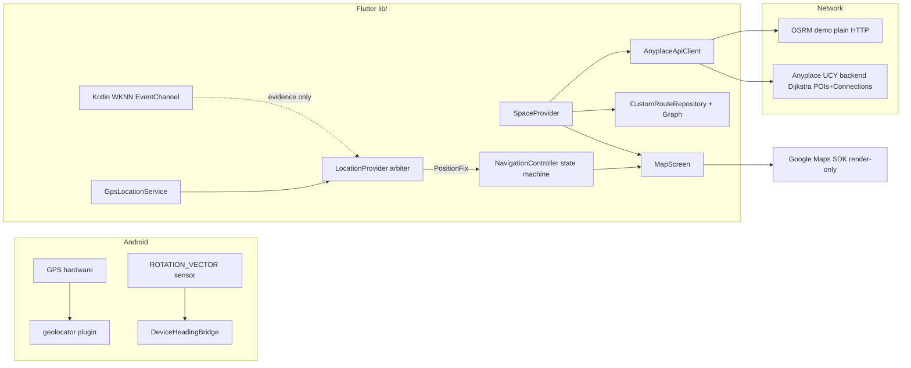
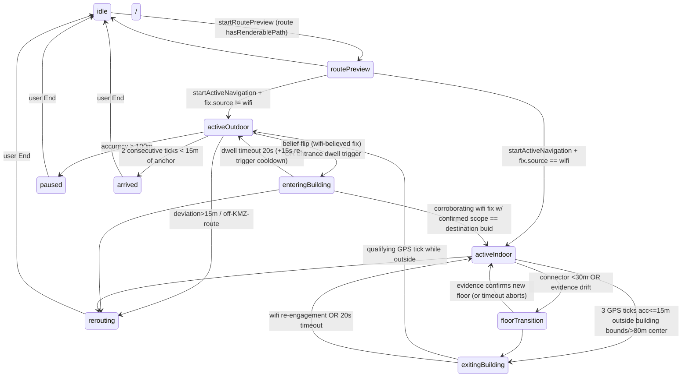

# Outdoor Navigation System — Actual Implementation Reference

## Scope of Truth

- **Codebases inspected:** Flutter client `clients/flutter/anyplace_campusfind/`
  (`lib/state/location_provider.dart`, `navigation_controller.dart`,
  `navigation_state_model.dart`, `space_provider.dart`; `lib/data/datasources/gps_location_service.dart`,
  `anyplace_api_client.dart`; `lib/data/models/user_location.dart`, `navigation_route_model.dart`,
  `route_segment.dart`, `position_fix.dart`, `route_progress.dart`;
  `lib/data/repositories/cross_building_router.dart`, `custom_route_repository.dart`,
  `custom_route_graph.dart`, `navigation_repository.dart`; `lib/ui/screens/map_screen.dart`,
  `lib/ui/utils/navigation_display.dart`; `lib/config/api_config.dart`, `navigation_config.dart`;
  `lib/main.dart`). Android native under `android/app/src/main/kotlin/eg/edu/ejust/anyplace_campusfind/`
  (`MainActivity.kt`, `sensing/DeviceHeadingBridge.kt` — heading only; native code plays
  **no** role in outdoor positioning). Backend `server/app/controllers/NavigationController.scala`,
  `modules/navigation/Dijkstra.scala`, `models/NavResultPoint.scala`, `conf/api.routes`.
  Tests: `test/{navigation_state_machine,location_provider_arbitration,location_provider_lifecycle,
  arrival,floor_transition,navigation_ui,custom_routes,custom_routes_integration,route_model}_test.dart`.
  No `api.json` defines navigation APIs; endpoint truth is `server/conf/api.routes` + `ApiConfig`.
- **Backend actually used:** `https://ap.cs.ucy.ac.cy:44` (public UCY Anyplace server,
  `ApiConfig._defaultBaseUrl`, override via `--dart-define=SERVER_URL`) **plus** a
  third-party OSRM demo server over plain HTTP for street-walking legs.
- **Routing is neither purely local nor Google's:** outdoor walking routes are computed by
  up to three engines combined client-side — (1) a bundled campus KMZ road graph routed
  locally with Dart Dijkstra, (2) the public OSRM foot-profile demo server, (3) the Anyplace
  backend Dijkstra over Mongo POI+Connection documents. Google Maps SDK renders only.
- **Source of truth:** source as of commit `2856a4b7`, branch `campusfind-migration`.
  Where comments disagree with code, this document reports the code and flags the discrepancy.

---

## Table of Contents

1. System Overview
2. How the User Starts Outdoor Navigation
3. Outdoor Positioning
4. GPS Location Acquisition
5. Location Update Frequency
6. LocationProvider / Position Arbitration
7. Outdoor Route Calculation
8. Backend Navigation API
9. Route Data / Polyline Construction
10. Route Rendering on Google Maps
11. User Location Marker
12. Camera Follow Behavior
13. Heading / Direction / Compass
14. Off-Route Detection
15. Rerouting
16. Arrival Detection
17. Navigation State Machine
18. Outdoor → Indoor Transition
19. Indoor → Outdoor Transition
20. GPS Accuracy / Filtering / Stability
21. Complete End-to-End Data Flow
22. Failure Cases
23. Current Limitations / Unsupported Behavior
24. Exact File / Class / Method Reference
25. Complete Sequence Example
26. Final Requirements (ACTUALLY Does / DOES NOT Do / Conclusions)

---

## 1. System Overview

Verified component responsibilities:

| Question | Verified answer |
|---|---|
| Which component obtains GPS? | `GpsLocationService` (geolocator plugin) — sole producer of outdoor coordinates. |
| Who owns canonical user location? | `LocationProvider.currentFix` (`PositionFix`); downstream reads only this. |
| Who starts/stops tracking? | `requestAndCenter()`/`startTracking()` start it; `stopTracking()` exists but has **no production call site** (tests only). |
| Who requests routes? | `SpaceProvider.requestRouteToSelectedPoi()` initially; `NavigationController._triggerReroute()` during sessions. |
| Who calculates routes? | Three engines: local KMZ-graph Dijkstra (`CustomRouteGraph`), remote OSRM foot profile, backend Dijkstra over POIs+Connections. |
| Who draws the route? | `MapScreen._buildPolylines()` → Google Maps `Polyline`s rebuilt on every notify. |
| Who moves/follows the camera? | `MapScreen._onNavigationChanged` → `_followUserPosition` → `_animateFollowCamera`, gated by `NavigationController.followMode`. |
| Who detects arrival? | `NavigationController._checkArrival` → `_arrive()`. |
| Who detects off-route? | `NavigationController._checkDeviationAndReroute` + `_updateCustomRouteProgress` snap check. |
| Who triggers rerouting? | Those same two methods call `_triggerReroute()`. |

```
REAL flow (verified):

Android GPS → geolocator stream → GpsLocationService → LocationProvider._gpsLocation
                                                             │ mode machine (Wi-Fi may win)
                                                             ▼
                                     currentFix : PositionFix ◄── Kotlin Wi-Fi WKNN (EventChannel)
                                           │                     (only after ≥3 qualifying scans)
                            ┌──────────────┴──────────────┐
                            ▼                             ▼
                 NavigationController                MapScreen (UI)
                 _onLocationChanged pipeline          ├─ marker _buildUserMarker
                 (belief flip, dwell, custom progress,├─ polylines _buildPolylines
                  deviation, transitions, approach,   └─ camera _followUserPosition
                  entrance proximity, segments,
                  arrival, GPS-loss pause)

Route request path:
SpaceProvider.requestRouteToSelectedPoi
   ├─ CrossBuildingRouter.composeRoute            (destination building ≠ user building)
   │    ├─ CustomRouteGraph.findRoute/findHybridRoute      ← bundled KMZ asset, LOCAL Dijkstra
   │    ├─ fetchOutdoorWalkingRouteWithMetadata            ← OSRM demo (plain HTTP)
   │    └─ fetchNavigationRoute[FromCoordinates]           ← backend Dijkstra (indoor legs)
   ├─ Strategy 1: POST /api/navigation/route/coordinates   ← backend
   ├─ Strategy 2: nearest loaded-floor POI → POST /api/navigation/route ← backend
   └─ Strategy 3: KMZ graph → hybrid edge-snap → OSRM→KMZ vertex → OSRM (+tail splice)
                  → OSRM-only → straight line; optional indoor tail stitched client-side
```



---

## 2. How the User Starts Outdoor Navigation

Exact startup chain, every hop:

| Step | User Action | File | Class.Method | What Actually Happens |
|---|---|---|---|---|
| 1 | Launch app | `lib/main.dart:25` | `NavigationController(spaceProvider:, locationProvider:)` | Constructor subscribes `_locationProvider.addListener(_onLocationChanged)` and `_spaceScope.addListener(_onSpaceProviderChanged)`. |
| 2 | automatic | `main.dart` | `LocationProvider()` ctor | Immediately subscribes the native estimate EventChannel (`_subscribeNativePositionStream`, location_provider.dart:197) — Wi-Fi evidence accumulates from t0 even outdoors. |
| 3 | automatic | `space_provider.dart:202` | `_customRouteRepository.loadRoutes()` | Parses bundled asset `'assets/navigation/university roads.kmz'` (`CustomRouteRepository._kmzAssetPath`) into routes + builds `CustomRouteGraph` before any user action. |
| 4 | Map appears | `map_screen.dart` initState post-frame | binds `setLocationProvider`, calls `locationProvider.requestAndCenter()` | Permission flow + first fix + stream start (§4). Spaces load via `POST /api/mapping/space/public`. |
| 5 | Grant permission | system dialog | `GpsLocationService.requestPermission` (gps_location_service.dart:37) | Checks service enabled first; `checkPermission` then `requestPermission`; maps `deniedForever`/`denied` to typed statuses. |
| 6 | First fix | `gps_location_service.dart:55` | `getCurrentPosition()` | `LocationAccuracy.high`, `timeLimit: Duration(seconds: 15)`; on failure falls back to `getLastKnownPosition()`; else null → status `error`. Success ⇒ `_gpsLocation = position`, `startTracking()`. |
| 7 | Pick destination | search sheet / building card / POI marker | `BuildingSearchSheet.onSelect → SpaceProvider.selectSpace(space)`; `_onBuildingTapped` (map_screen.dart:560); POI marker tap → `selectPoi(poi)` (map_screen.dart:776) | Loads floors/POIs for selection; camera animates via `_animatedMapMove(latlng, 16.5)`. |
| 8 | Tap "Navigate" | bottom sheet | `PoiDetailCard.onNavigate` → `SpaceProvider.requestRouteToSelectedPoi()` (space_provider.dart:653) | Cascade of §7; result stored in `activeNavigationRoute`. |
| 9 | Tap "Start Directions" | `map_bottom_sheet.dart:209` | `startRoutePreview(...)` then `startActiveNavigation()` then `widget.onFitRouteBounds?.call(spaceProvider)` → `MapScreen._fitRouteBounds` (:685) | Preview seeds anchor + `_currentNavigatingFloor = selectedFloor.floorNumber` (navigation_controller.dart:339); active entry chooses belief purely from fix source: `fix?.source == PositionSource.wifi ? activeIndoor : activeOutdoor` (:372-376). A cold outdoor user enters **activeOutdoor**. |

There is no separate "outdoor mode" switch: Start Directions while the arbiter believes GPS *is* outdoor navigation.

---

## 3. Outdoor Positioning

The outdoor coordinate is produced exclusively by this chain:

```
Android fused location (via geolocator)
  → Geolocator.getPositionStream(locationSettings)   [gps_location_service.dart:112]
  → .map(_toUserLocation)                            [UserLocation{lat,lon,accuracy,altitude,heading,speed,timestamp}]
  → LocationProvider.startTracking listener          [location_provider.dart:684]
  → _gpsLocation = location                          (raw overwrite — no filtering anywhere)
  → _evaluateArbitration()                           [:474]
  → _buildGpsFix()                                   [:482] — unconditional while mode==outdoor
  → _currentFix = PositionFix(source: gps, accuracy, confidence, timestamp)
```

Verified properties:

- **Plugin:** `geolocator`. No platform channel in this app produces positions; the native
  Kotlin code carries only Wi-Fi radiomap control and heading.
- **Settings:** Android: `AndroidSettings(accuracy: LocationAccuracy.high,
  distanceFilter: effectiveFilter, intervalDuration: Duration(milliseconds: 500))`.
  Non-Android: plain `LocationSettings(high, distanceFilter)`.
  `effectiveFilter = distanceFilter < 1 ? 0 : distanceFilter.round()` (line :98) — the app
  always calls `getPositionStream()` with the default `0.3`, so the displacement gate is
  **disabled (0)** and cadence is decided by the OS provider plus a **500 ms minimum interval**.
- **getCurrentPosition:** same accuracy, `timeLimit 15 s`; fallback `getLastKnownPosition()`.
- **No filtering/smoothing/outlier rejection/speed gating exists between the sensor and
  `_currentFix`.** Every emitted fix overwrites `_gpsLocation` verbatim. The only quality
  signal attached is a static confidence mapping (`_gpsConfidence`: ≤5 m→0.9, ≤15 m→0.7,
  else 0.5). Accuracy itself is passed through unmodified.
- `UserLocation.heading` and `.speed` from geolocator are used only later by UI heading
  logic (§13); `currentLocation` (the value navigation consumes) strips them — it is
  rebuilt from `PositionFix` with lat/lon/accuracy/timestamp only (location_provider.dart:156).
- Duplicate suppression beyond the OS layer: none. Identical coordinates still trigger
  `_evaluateArbitration()` + full notify.

## 4. GPS Location Acquisition

Pipeline verification — the hypothesized chain exists exactly as:
**GPS hardware/Android → Geolocator → GpsLocationService → LocationProvider → PositionFix
→ NavigationController & MapScreen.**

| Concern | Actual implementation |
|---|---|
| Service enabled check | `Geolocator.isLocationServiceEnabled()` wrapped in try/catch → false on error (gps_location_service.dart:13). |
| Permission check/request | `checkPermission()` (:22) returns `serviceDisabled` if service off; `requestPermission()` (:37) escalates `denied`→prompt; maps `always/whileInUse→granted`, `deniedForever→deniedForever`, else `denied`. |
| Initial request | `requestAndCenter()` (location_provider.dart:606): service check → permission switch (sets `permissionDenied` / `permissionDeniedForever` / `serviceDisabled` statuses with user-facing messages) → `getCurrentPosition()` → sets `_gpsLocation`, status `tracking`, calls `startTracking()`. |
| Continuous tracking | `startTracking()` (:674): guards re-entry (`if (_isTracking) skip`), cancels previous sub, subscribes `getPositionStream()`. Listener: overwrite `_gpsLocation`, status tracking, `_evaluateArbitration()`, `notifyListeners()`. |
| Stream errors | `onError` sets `_errorMessage = 'GPS tracking error: …'` and notifies; **subscription stays alive** (no cancel/retry logic). |
| Stream cancellation | Only `stopTracking()` (:704) and `dispose()` (:723). Verified: no production caller of `stopTracking` — tracking runs for the app's lifetime once started. |
| Lifecycle | No lifecycle hooks in the service; `MapScreen.didChangeAppLifecycleState` (map_screen.dart:312) only logs pause/resume and re-centers the camera on resume when `followMode` — it does not touch the GPS subscription. |
| Re-request button | `_onMyLocationTapped` (map_screen.dart:590) calls `requestAndCenter()` again; success animates to `MapConfig.focusedZoom`, failure shows SnackBar with `errorMessage` then falls back to selected space / first space / default center. |
| Test hook | `setGpsLocation(UserLocation)` (:712) injects directly into arbitration. |

## 5. Location Update Frequency

Measured from code — no "approximately every second" claims:

- **Trigger:** each OS provider emission passing geolocator's settings: Android =
  `intervalDuration 500 ms` minimum + `distanceFilter 0` (no displacement gate) +
  `LocationAccuracy.high`. So the floor is one event per 500 ms; there is no fixed period
  guarantee above that — the OS decides.
- **Throttle/debounce in Dart:** none in `GpsLocationService` or `LocationProvider`. Each
  event rebuilds `_currentFix` and fires `notifyListeners()`.
- **NavigationController processing:** `_onLocationChanged` (navigation_controller.dart:439)
  runs on **every** LocationProvider notification, but short-circuits: not session-live →
  drop; state `arrived` → drop; `paused` → only `_checkGpsRecovery`; `location == null` →
  drop; `rerouting` → drop; `floorTransition` → timeout check then hold-and-return;
  post-floor-switch window (`postFloorSwitchSuppressSeconds = 10`) → return early.
  Otherwise the full 11-step pipeline executes (§21).
- **MapScreen:** `_onNavigationChanged` runs on every NavigationController notify (i.e.,
  effectively every accepted fix). Camera animation is additionally gated per-update by
  movement ≥ **0.3 m** or bearing change ≥ **1.5°** (`cameraMoveThresholdMeters`,
  `cameraBearingThresholdDegrees`) and coalesced while an animation is in flight
  (`_animateFollowCamera`, map_screen.dart:499). So no, a new camera animation does NOT
  happen for every update.
- **Marker/polyline widgets:** recomputed on every rebuild of the `GoogleMap` widget
  (no per-fix throttle), but base markers are memoized by signature (map_screen.dart:735)
  so per-tick cost is mostly user-marker + polyline set construction.

## 6. LocationProvider / Position Arbitration

`lib/state/location_provider.dart` — exactly one believed source at a time
(`_ArbiterMode.outdoor | indoor`), switched by measurement evidence only:

- **GPS validity checks: NONE.** In outdoor mode every non-null `_gpsLocation` becomes
  the canonical fix (`_evaluateArbitration` → `_buildGpsFix`). No accuracy gate, no age
  gate, no jump rejection applies to GPS inside the provider.
- **Wi-Fi qualification gate** `_qualifies` (:245): estimate valid + non-empty buid/floor
  + `matchedAps ≥ stabilityMinMatchedAps (2)` + `matchedAps/totalAps ≥ minMatchedRatio (0.25)`.
- **Outdoor→indoor flip:** `_handleOutdoorEvidence` (:261) requires
  `indoorEnterConfirmCount = 3` consecutive qualifying estimates; then Wi-Fi wins.
- **Indoor→outdoor fallback:** 3 bad/outlier cycles (`indoorExitStaleCycles`) OR the
  10 s stale timer (`indoorStaleTimerSeconds`) firing without fresh estimates
  (`_exitIndoorMode`) — after which `_buildGpsFix` takes over automatically (GPS was
  streaming throughout).
- **Outlier guard (Wi-Fi only):** >30 m jump within the *same* resident-map identity holds
  the previous fix with `status: held` (`_isOutlierJump` :330, `_holdWifiFix` :366).
  GPS has no equivalent guard.
- **Scope identity:** `(buid, floor)` confirmed only after `scopeConfirmCount = 3`
  consistent winning estimates (`_advanceClaim` :382); until then `fix.hasScope == false`.
  Exiting indoor mode resets all claim state.
- **Accuracy/confidence:** Wi-Fi accuracy = clamp(max(topKSpread,bestDistance), 2..30 m);
  confidence = 0.45·ratioScore + 0.25·spreadScore + 0.30·stabilityScore. GPS confidence
  mapping as §3; GPS accuracy passes through raw.

Scenario answers:

| Scenario | What happens |
|---|---|
| GPS valid | It IS the canonical fix (mode outdoor default). |
| GPS becomes inaccurate | Provider keeps believing it (no gate); downstream guards react instead: controller pauses at accuracy > 100 m (`_checkGpsLoss`), exit-detection requires ≤ 15 m. |
| Wi-Fi available outdoors | Evidence accumulates; after 3 consecutive qualifying scans Wi-Fi overrides GPS entirely. |
| Wi-Fi disappears indoors | 3 bad cycles or 10 s silence → arbiter exits indoor → GPS believed again. |
| Outdoors → indoors | Same 3-scan override; controller separately notices via belief flip/dwell (§18). |
| Indoors → outdoors | Reverse hysteresis above; controller's EXITING_BUILDING flow adds its own confirmation (§19). |

So: **outdoor navigation does not always use GPS** — a sufficiently consistent Wi-Fi
signal overrides it, and that is by design (covered areas).

---

## 7. Outdoor Route Calculation

Entry: `SpaceProvider.requestRouteToSelectedPoi()` (space_provider.dart:653).
Guards: `_selectedPoi` null → error "Select a POI first."; `_selectedFloor` null → error;
`currentLocation` null → error "Current location is unavailable…". Then
`requestId = ++_navigationRouteRequestId` (staleness token checked after every await),
recent-waypoint cache add (`_cacheService?.addRecentWaypoint(poi.puid)`), status `loading`.

**Stage 0 — cross-building detection:** `_detectBuildingFromPolygon(currentLocation)`
(point-in-polygon over loaded space polygons). If the destination POI's building differs
from the user's containing building (or user is outside all buildings) →
`CrossBuildingRouter.composeRoute(userLocation, targetSpace, allBuildings, targetPuid)`
(cross_building_router.dart:49):

1. **Exit POI** (`_selectExitPoi`): only entrance/door POIs (`PoiClassification.isEntrance/isDoor`),
   ground floor `'0'/'G'` preferred; centroid fallback.
2. **Exit segment** (`_generateExitSegment`): backend coordinate route to the exit POI
   (`fetchNavigationRouteFromCoordinates`) or straight-line fallback flagged
   `isIncomplete + isFallbackLocation`.
3. **Entrance selection two-pass scoring** (`_selectEntrancePoi`): for each candidate
   entrance/door of the target building call OSRM (`fetchOutdoorWalkingRouteWithMetadata`)
   → score = `distance·0.6 + angleDiff(finalBearing, centroidToEntranceBearing)·100·0.4`;
   lowest wins; single-candidate shortcut; centroid fallback.
4. **Outdoor segment five-tier** (`_generateOutdoorSegment`):
   Tier 1 pure KMZ graph `findRoute`; Tier 2 hybrid edge-snap `findHybridRoute(snapThreshold: 150.0)`;
   Tier 3 `_buildOsrmToCustomRoute` — OSRM from user to the campus **route endpoint**
   nearest the user that is graph-connected to a vertex within 500 m of the destination,
   then local Dijkstra through campus roads, then straight line to destination;
   Tier 4 raw OSRM exit→entrance with `_spliceCustomTail` (search OSRM path backward for a
   point snappable within 150 m, splice graph path to dest-vertex ≤500 m); Tier 5 OSRM-only;
   final fallback straight line flagged incomplete.
5. **Entrance segment** (`_generateEntranceSegment`): backend POI→POI route
   (`fetchNavigationRoute`) → backend coordinate route → `_routeViaConnectors`
   (relay through `poisType == 'None'` connector POIs with a connector→connector backend
   route in between) → straight-line fallback flagged incomplete.
6. Assemble via `NavigationRouteModel.fromSegments`; cap at **6 segments**
   (`validSegments.length > 6 → removeRange(6,…)`); status `partial` if any segment
   `isIncomplete`, with `partialRouteWarning`.

If Stage 0 returns null/throws, the cascade proceeds:

- **Strategy 1 — backend coordinate route** (:726): `getRouteFromCoordinates(latitude,
  longitude, floorNumber: floor.floorNumber, destinationPuid)` →
  `POST /api/navigation/route/coordinates`. ApiException messages matching
  'not supported' / 'no route found' / 'not be connected' or status 400/404 fall through
  to Strategy 2; any other failure aborts with error status.
- **Strategy 2 — POI-to-POI** (:778): nearest loaded-floor POI by haversine to current
  location → `getRouteBetweenPois(fromPuid, toPuid)` → `POST /api/navigation/route`.
  Any failure falls through.
- **Strategy 3 — hybrid outdoor+optional indoor tail** (:840): KMZ tiers as above but with
  `spliceCustomTail(connectionThreshold: 150.0)` and OSRM last; if <2 points survive →
  two-point straight line stamped from current location to destination POI. Outdoor
  waypoints are wrapped as `NavigationRoutePoint.outdoor(..., buid: poi.buid, floorNumber:
  poi.floorNumber)` — i.e. **stamped with the DESTINATION POI's building/floor**. Then an
  indoor tail is attempted: first entrance POI on loaded floors → backend POI→POI route →
  `_routeIndoorViaConnectors` relay → merged by `NavigationRouteModel.hybrid`.
- Result stored: `_activeNavigationRoute`, status `ready`; `_navigationRouteErrorMessage`
  carries partial warnings.

Authentication: none on any endpoint (public server endpoints).

## 8. Backend Navigation API

The backend performs **graph routing between POIs only — it has no road network and no
true outdoor routing.**

| Aspect | Verified fact |
|---|---|
| Controller | `server/app/controllers/NavigationController.scala` |
| Endpoints | `POST /api/navigation/route` (body `pois_from`,`pois_to`) → `getNavigationRoute`; `POST /api/navigation/route/coordinates` (body coordinates_lat/lon, floor_number, pois_to) → `getNavigationRouteXY`. Wired in `server/conf/api.routes`. |
| Same-floor request | `navigateSameFloor`: vertices = that floor's POIs; edges = Connection documents touching them. |
| Cross-floor same-building | `navigateSameBuilding`: vertices = ALL building POIs; edges = ALL building Connections (this yields multi-floor paths through stairs/elevator connectors). |
| Different buildings | Hard rejection *"Navigation between buildings not supported yet."* — hence client-side CrossBuildingRouter exists. |
| Coordinate origin | Snapped to the **nearest POI** of `(buid, floor)`; empty floor → *"Navigation is not supported on your floor."* Snap distance beyond `ROUTE_MAX_DISTANCE_ALLOWED = 5.0 km` rejected (NavigationController.scala:56,:208). |
| Algorithm | `Dijkstra.scala`: vertices keyed by POI puid; edges from Mongo `Connection` docs (`pois_a↔pois_b`, optional weight); relaxation `dv.minDistance + e.weight` (:154); reconstruction `getShortestPath` (:177). |
| Response | `{ "num_of_pois": N, "pois": [ … ] }` parsed into `NavigationRoutePoint`s by `NavigationRouteModel.fromJson` (invalid entries skipped individually, :180). |

Consequence: every "outdoor" answer the *Anyplace* server gives is a point-to-point walk
between outdoor POIs (e.g., entrances) across open ground — real street paths come only
from OSRM/KMZ tiers.

## 9. Route Data / Polyline Construction

- Server JSON → `NavigationRouteModel.fromJson` → ordered `points: List<NavigationRoutePoint>`
  `{latitude, longitude, puid, buid, floorNumber, poisType, isOutdoor}`; `status` defaults ready.
- OSRM → `OsrmRouteResult{points, distanceMeters, durationSeconds, finalBearingDegrees}`
  (bearing from last two geometry coords); geometry coords are `[lon, lat]` and swapped.
- KMZ asset → `KmzLoader.parseKmzBytes` → LineString features ≥2 coords → `CustomRoute{name, vertices}`;
  `CustomRouteGraph.build(routes)` indexes vertices/edges/junctions; queries:
  `snapToRoute(pos, maxSnapDistance)` → `SnapResult{snappedPoint, distanceMeters, edgeIndex, edgeProgress, routeIndex}`;
  `routeBetween` (vertex-snapped Dijkstra), `routeBetweenEdges(snapThreshold)`,
  `shortestPath`, `nearestVertex(pos, maxDistance)`, `getRouteEndpoints()` (dead-end vertices
  where campus roads meet public roads).
- Segment model: `RouteSegment` factories `.outdoor/.exit/.entrance/.fallback`;
  `RouteSegmentType {outdoorWalking, indoorRouting, floorTransition, entranceTransition, exitTransition}`;
  fields include points/floorNumber/buildingId/connectorPoiId/instruction/distance/
  isIncomplete/isFallbackLocation.
- Client projections used downstream: `hasRenderablePath (points.length ≥ 2)`,
  `polylinePoints` (all), `polylinePointsForFloor(f)` (filter `p.floorNumber == f`),
  `outdoorPolylinePoints` / `indoorPolylinePoints` (`isOutdoor` split),
  `floorTransitionIndices` (index before each floor change), `fromSegments` synthesizes
  puids `<segmentType>_<n>` and sets `isOutdoor` only for `outdoorWalking`.
- Distance/duration: segment distances computed locally by summing haversine edges
  (`_computePathDistance`); OSRM duration is captured but not surfaced anywhere in the UI.

## 10. Route Rendering on Google Maps

`MapScreen._buildPolylines(spaceProvider)` (map_screen.dart:820), executed on every build:

1. **Custom KMZ routes always drawn when loaded** — white outline width 12 +
   gray `#9E9E9E` width 6 per route. ⚠️ Discrepancy: the comment says "shown as green
   polylines when no active navigation", but the code draws them unconditionally, layered
   under/over the active route.
2. **Segment routes** (`route.hasSegments`): one Polyline per non-empty segment styled by
   `_segmentStyles` (:900): outdoorWalking blue `#1E88E5` α0.9 width 5 dotted/gap10;
   indoorRouting `AppTheme.primary` α0.85 w6 solid; exitTransition orange dashed w5;
   entranceTransition green dashed w5; floorTransition purple dotted w4.
3. **Legacy routes**: `route_outdoor` = `outdoorPolylinePoints` (ALL outdoor-flagged
   points regardless of floor) dotted blue w5; `route_indoor` = `indoorPolylinePoints`
   solid red w6. No floor filtering at render time — filtering happens only inside
   deviation math (§14).
- Cleared: `endNavigation()` nulls `_activeRoute` (controller) and scope route, so next
  build drops route polylines. Replaced wholesale on successful reroute.
- Multi-building routes render fully (all segments) — there is no per-building clipping.

## 11. User Location Marker

- `_buildUserMarker(displayLocation)` (map_screen.dart:797): `MarkerId('user_location')`,
  flat, anchor center; icon azure dot fallback; directional icon + `rotation` when
  effectiveHeading > 0.5° (priority: device rotation-vector heading `_deviceHeading`,
  else movement/compass-derived `_currentHeading`). Position = `displayLocationFor(...)`
  output — during floor transitions the held pre-transition position, else live location.
- Google's native blue dot is disabled (`myLocationEnabled: false`, :1076) — the custom
  marker is the only position indicator, shown identically during preview and active
  navigation (preview shows it because tracking runs independently of nav state).
- Update cadence: marker set rebuilt on every widget rebuild triggered by provider
  notifications (every accepted fix); rotation-only updates flow through
  `_markerHeadingNotifier` ValueListenable so heading changes repaint just the marker layer.

## 12. Camera Follow Behavior

- **Driver:** exclusively `MapScreen._onNavigationChanged` (nav listener) when
  `nav.isActive && nav.followMode`; computes display location, heading, then
  `_followUserPosition(display.latLng, nav.subState, bearing)` (map_screen.dart:471).
- Zoom: `indoorFollowZoom 19` / `outdoorFollowZoom 17`; lower-third offset
  `latOffset = screenHeight · (1 − 0.67) · 0.000008` applied to target latitude
  (a screen-height-proportional hack, not true screen-to-meter projection).
- Gating/coalescing (`_animateFollowCamera` :499): skip unless moved ≥0.3 m or bearing Δ≥1.5°;
  while animating, newest target coalesced into pending and applied once with gate bypassed.
- Tilt: never set (default). Bearing: camera rotates to smoothed heading (§13).
- **Manual pan exits follow:** `onCameraMove` (:1065) → if active && followMode &&
  `!_isProgrammaticMove` → `nav.exitFollowMode()`. Re-center button (:1232) calls
  `nav.resumeFollowMode()`. App resume re-follows if still in followMode (:319-331).
- Start of session: `_fitRouteBounds` (:685) frames the whole route once (padding
  `routeFramePadding 60 m` converted to degrees; estimated zoom `19 − clamp(maxSpan·100, 0..15)`
  clamped to `[MapConfig.indoorFloorplanZoom, 19]`), then follow takes over.
  **No refit after reroutes** — no call site re-invokes fit-bounds when `_activeRoute` changes.
- Mismatch vs Google-Maps-style expectations: continuous follow exists but is opt-out by pan
  and stays out until manual re-center; there is no bearing-lock toggle and no tilt/perspective.

## 13. Heading / Direction / Compass

- Native: `DeviceHeadingBridge.kt` — `TYPE_ROTATION_VECTOR` at `SENSOR_DELAY_GAME`
  (~50 Hz), screen-rotation-aware azimuth, EventChannel
  `eg.edu.ejust.anyplace_campusfind/heading_stream`; Dart side `DeviceHeadingService`.
- UI fusion `MapScreen._updateHeading` (:409): compass sample cached when `>0 && ≤360`
  (this includes geolocator's `UserLocation.heading`); fresh ≤2000 ms preferred;
  otherwise movement bearing requiring `speed > 0.2 m/s && moved > 0.15 m`;
  EMA smoothing α=0.6 (`_smoothHeading` wraps at ±180°); recomputation rate-limited to
  200 ms; stationary >1000 ms eases heading toward 0 (north).
- Consumers: user-marker rotation/icon (§11) and follow-camera bearing (§12). Nothing else.
- **Heading is presentation-only**: it never touches PositionFix, routing, deviation,
  arrival, or state transitions.

## 14. Off-Route Detection

Implemented in `NavigationController._checkDeviationAndReroute` (:621), evaluated on every
non-suppressed location tick:

1. Skips when `_activeRoute == null`, state rerouting, or floorTransition; cooldown guard
   `_lastRerouteTime + rerouteCooldownSeconds (15)`.
2. **Custom-route branch (outdoor only):** `_updateCustomRouteProgress` (:598) runs earlier
   each tick when state==activeOutdoor and `customRouteRepository.isLoaded`:
   `getRouteProgress(latLng, maxSnapDistance: 50, offRouteThreshold: 30)` →
   `isOnRoute == snap.distanceMeters <= 30`. If progress exists and `!isOnRoute` →
   `_triggerReroute()` immediately. **A single bad measurement triggers** — no confirmation
   streak. GPS accuracy does NOT scale this decision.
3. **Polyline fallback:** `_computeMinDeviation(point, route)` (:653) = min point-to-segment
   distance over `route.polylinePointsForFloor(_currentNavigatingFloor)` (haversine-based
   clamped projection, `_pointToSegmentDistance` :669). > `deviationThreshold 15 m` →
   `_triggerReroute()`.
   ⚠️ Floor-filter nuance: hybrid Strategy-3 routes stamp outdoor waypoints with the
   DESTINATION POI's floor; deviation only sees geometry whose floor equals
   `_currentNavigatingFloor` (seeded from the selected floor at preview). If those disagree,
   `polylinePointsForFloor` returns <2 points → deviation = ∞ → polyline check silently
   never fires for such sessions (custom-route branch then carries off-route duty alone).

## 15. Rerouting

Automatic rerouting EXISTS. `_triggerReroute()` (navigation_controller.dart:692):

- Guards: state must be `activeOutdoor` / `activeIndoor` / `enteringBuilding`;
  `_destinationPuid` non-null; current location non-null; not already rerouting.
- `_lastRerouteTime = DateTime.now()` stamped **before** work (15 s cooldown).
- `_transition(NavigationState.rerouting)` (dynamic overlay; `previousActiveState = origin`);
  UI shows rerouting via status/snapshot.
- **Step 1 (outdoor only):** KMZ graph — `findRoute(user→destSpace)`; if <2 points,
  `findHybridRoute(..., snapThreshold: 100.0)` (hard-coded here, unlike the 150 used at
  request time); success → `createNavigationRouteFromPath` (single outdoorWalking segment,
  status ready) → replace `_activeRoute` → restore origin state.
- **Step 2:** API reroute loop `for attempt in 0..rerouteMaxRetries(3)`:
  `getRouteFromCoordinates(latitude, longitude, floorNumber: _currentNavigatingFloor ?? '0',
  destinationPuid)`; on renderable route adopt it and break; on exception log and continue;
  backoff `Duration(seconds: 1 << attempt)` = 1 s, 2 s, 4 s between attempts.
  Note: the floor sent is the indoor bookkeeping floor even when outdoors — the backend
  snaps to that floor's POIs, so outdoor coordinate reroutes effectively re-enter at the
  nearest POI of the last-known floor.
- After loop: dynamic restore edge `rerouting → previousActiveState`. On total failure the
  stale route remains active (session limps on with old polyline).
- User End during awaits is respected: adoption checks `_state.isSessionLive`.
- External route changes adopted via `_onSpaceProviderChanged` (:487): scope route differing
  from controller's is adopted mid-session and the arrival anchor re-resolved.

## 16. Arrival Detection

`_checkArrival(location)` (:1371), runs every tick in `activeOutdoor`/`activeIndoor` only:

- Anchor `_resolveArrivalAnchor()` (:1339): destination POI if present in scope POIs, else
  the active route's final point (`buid/floor` kept when non-empty). Re-resolved whenever
  an external route is adopted.
- Outdoor path (`activeOutdoor`): pure proximity — haversine to anchor
  `< arrivalProximityThresholdMeters (15)` increments `_arrivalConfirmationCounter`;
  ≥ `arrivalConfirmationCount (2)` consecutive qualifying ticks → `_arrive()`.
  A tick ≥15 m resets the counter. No building/floor identity requirement outdoors.
  GPS accuracy is not considered (a 40 m-accuracy fix can confirm arrival).
- Indoor path adds identity gating: fix must have confirmed scope matching anchor buid+floor.
- `_arrive()` requires `_state.isActivity`; transitions to `arrived`. `_onLocationChanged`
  early-returns in arrived — no further evaluation ticks. Tracking/GPS continue untouched.
  Exit only via user End (`arrived → idle`). Banner label:
  `'Arrived at ${destinationSpace?.name ?? 'destination'}'` (navigation_display.dart:21).

## 17. Navigation State Machine

States (`navigation_state_model.dart:18`): idle, routePreview, activeOutdoor,
enteringBuilding, activeIndoor, floorTransition, exitingBuilding, arrived, paused,
rerouting. Legacy projections `NavigationPhase {idle,preview,active}` +
`NavigationSubState {outdoor,indoor,transitioning}` derive from it.



Dynamic edges beyond the table (controller): `paused`/`rerouting` →
`previousActiveState` on recovery/reroute-completion; user End → idle from ANY state
(`isAllowedNavigationTransition` special-cases `to == idle`, :175).
Illegal edges are rejected with a debugPrint, never thrown (:154-164).
Pause bookkeeping: `_pauseNavigation('GPS signal weak — waiting for better signal')` on
accuracy >100 m (**hard-coded**, navigation_controller.dart:1422); recovery when ≤100 m
(:1430) restores `previousActiveState`.

## 18. Outdoor → Indoor Transition

Implemented as a staged client-side flow (the server never sees a combined route):

1. **Preload (100 m):** `checkBuildingApproach` (:1075) — within
   `buildingPrepThreshold 100` of destination building center → `_preLoadBuildingData`
   auto-selects the building (`selectSpace`) which loads floors/POIs. Cancel if user
   retreats past `buildingPrepCancelThreshold 150`.
2. **Entrance dwell (25 m):** `checkEntranceProximity` (:1113) — nearest entrance/door POI
   within `entranceTransitionThreshold 25` (fallback: building center within
   `entranceFallbackThreshold 30`) and POIs loaded → `_triggerEntranceApproach` (:1166):
   respects `_entryDwellCooldownUntil` (15 s after a timed-out dwell); preloads floor by
   tiers (route-derived arrival floor → `'0'` → numerically lowest) via
   `_spaceScope.selectFloor` (this DOES auto-load floorplan+radiomap+POIs through the
   normal cascade); sets `_currentNavigatingFloor` as ROUTE CONTEXT; enters
   `enteringBuilding`. Comment claims "indoor route refresh deferred until corroboration"
   — **no such refresh exists anywhere**; the polyline stays as-is.
3. **Corroboration:** `_maintainDwell` (:526) — a Wi-Fi-believed fix corroborates only if
   `fix.hasScope && fix.buildingId == destination.buid` (`_entryCorroborated` :584);
   then → `activeIndoor`. Timeout `enteringCorroborationTimeoutSeconds 20` → back to
   `activeOutdoor` + cooldown. Meanwhile positioning itself may already believe Wi-Fi
   (arbiter's independent 3-scan rule) → `_evaluateBeliefFlip` (:508) shortcuts straight
   into `enteringBuilding` from anywhere outdoors.
4. **Partial vs full:** fully implemented up to here. What does NOT happen automatically:
   route recalculation/replacement at entry, entrance-segment trimming, or any turn-by-turn
   handoff message beyond the "Entering building…" label.

## 19. Indoor → Outdoor Transition

1. `_checkBuildingExit` (:1005) in `activeIndoor`: requires source ≠ indoorWifi AND
   raw `gpsLocation != null` AND `gpsLocation.accuracy ≤ exitAccuracyThreshold 15` AND
   outside building — primary test `!floorplan.bounds.contains(pos)` when valid bounds
   exist, else distance from building center > `exitDistanceThreshold 80`. Three
   consecutive passes (`exitConfirmationCount 3`) → `exitingBuilding`.
2. Dwell resolution in `_maintainDwell`: any Wi-Fi re-engagement → back to `activeIndoor`;
   silence > `exitingCorroborationTimeoutSeconds 20` → back to `activeIndoor` (safe default);
   else one more qualifying GPS tick (acc ≤15, still outside) → `_applyBuildingExitSideEffects()`
   **then** `activeOutdoor`.
3. Side effects (:1058): clears `_currentNavigatingFloor`, expected floor, preload latch;
   calls `_spaceScope.clearSelection()` → space_provider.dart:452 → resets selection,
   nulls the SCOPE's active route (`_resetNavigationRouteState`) and
   `_resetRadioMapState()` (:1898) → native `clearRadioMap()` wipes ALL radiomap residency
   mid-session. The controller's private `_activeRoute` survives, so the session continues
   with its route object but no indoor positioning capability until floors are re-selected.
   (This matches the known issue recorded in docs/NAVIGATION_SYSTEM_ANALYSIS_CURRENT_COMPARISON.md #12.)
4. Marker/camera: marker switches to the GPS-sourced fix automatically (same single-marker
   design); camera zoom drops 19→17 via subState projection once state is outdoor again.

## 20. GPS Accuracy / Filtering / Stability

Explicit inventory:

| Mechanism | Present? | Where / value |
|---|---|---|
| Accuracy threshold gating the fix itself | **NO** — provider accepts any accuracy | location_provider.dart:482 |
| Accuracy-based confidence | yes | `_gpsConfidence`: ≤5 m→0.9, ≤15 m→0.7, else 0.5 |
| Navigation pause on bad GPS | yes | >100 m hard-coded → `paused` (:1422); resume ≤100 m (:1430) |
| Exit-detection quality gate | yes | ≤15 m (`exitAccuracyThreshold`) ×3 ticks |
| Stale-GPS timer | **NO** (only the indoor estimate has a 10 s staleness timer) | — |
| Jump/outlier rejection for GPS | **NO** (30 m outlier guard applies to Wi-Fi fixes only) | :330 |
| Speed filtering of positions | **NO** (speed used only for bearing acceptance >0.2 m/s) | map_screen.dart:445 |
| Coordinate smoothing (GPS) | **NO** (EMA smooths *heading*, never coordinates) | — |
| Stability window | Wi-Fi-only rolling window 5 s / ≥3 estimates / Δ≤15 m | location_provider.dart:554 |
| Consecutive confirmation counts | enter indoor ×3; scope ×3; exit ×3; arrival ×2 | config |
| Minimum movement distance | camera gate 0.3 m; bearing gate 0.15 m | config |

## 21. Complete End-to-End Data Flow

```
User opens app
 → permission/service checks (GpsLocationService)
 → getCurrentPosition(15 s limit) → getLastKnownPosition fallback
 → LocationProvider.startTracking → geolocator stream (500 ms interval, filter 0)
 → every event: _gpsLocation overwrite → _evaluateArbitration → PositionFix(gps)
 → NavigationController._onLocationChanged (per tick, when session live):
     _evaluateBeliefFlip → _maintainDwell → _updateCustomRouteProgress(KMZ snap)
     → _checkDeviationAndReroute → _checkFloorTransition → _checkBuildingExit
     → checkBuildingApproach(100 m) → checkEntranceProximity(25 m)
     → _checkSegmentTransition(endpoints 10 m) → _checkArrival(<15 m ×2)
     → _checkGpsLoss(>100 m pause) → notifyListeners
 → MapScreen._onNavigationChanged: displayLocationFor → _updateHeading
     → followUserPosition (gate 0.3 m/1.5°, coalesced animateCamera)

First route request:
 selectPoi → requestRouteToSelectedPoi → [cross-building compose | strategy 1|2|3]
   ├─ POST /api/navigation/route/coordinates      (backend snap+Dijkstra)
   ├─ POST /api/navigation/route                  (POI-to-POI)
   ├─ local KMZ Dijkstra / hybrid edge-snap       (assets/navigation/university roads.kmz)
   └─ GET http://router.project-osrm.org/route/v1/foot/... (10 s timeout)
 → NavigationRouteModel(points[, segments]) → MapScreen polylines → Start Directions
 → activeOutdoor → per-tick pipeline above → optional rerouting (KMZ → API×3 backoff)
 → arrival (<15 m ×2) → arrived → banner → End → idle
```

## 22. Failure Cases

| Case | Actual behavior (source) |
|---|---|
| GPS permission denied | Status `permissionDenied`, message "Location permission was denied."; no fixes; navigation impossible. Surfaced only via my-location button SnackBar path. |
| Permission permanently denied | `permissionDeniedForever` + settings-directed message; same dead end. |
| Location services off | `serviceDisabled` before permission is even requested. |
| No first fix (15 s timeout) | Falls back to `getLastKnownPosition()`; if that fails → status `error`, "Unable to acquire GPS signal…". |
| Poor accuracy | Believed regardless (§20); >100 m pauses session with "GPS signal weak — waiting for better signal". |
| Stale GPS | No detection mechanism — last coordinates remain canonical indefinitely while mode is outdoor and Wi-Fi never qualifies. |
| Stream error | `_errorMessage` set, subscription kept alive; no retry/backoff. |
| Backend unavailable / timeout (30 s) | Strategy 1/2 errors cascade onward; cross-building compose degrades to OSRM/KMZ/straight-line tiers with `partial` warnings; reroute retries ×3 then keeps stale route. |
| OSRM unreachable / non-200 / code≠Ok / timeout(10 s) | Returns empty list/null → next tier or straight-line incomplete segment flagged `isFallbackLocation`. |
| Invalid destination (no POI/floor/location) | Immediate error statuses: "Select a POI first." / "Select a floor before requesting a route." / "Current location is unavailable. Center on your location first." |
| Empty route (`points < 2`) | `hasRenderablePath == false` → preview refused (`startRoutePreview` returns), reroute adoption skipped, cascade falls through. |
| Malformed route JSON | Missing `pois` list throws FormatException; individual invalid points skipped during parse (:180). |
| Off-route >15 m (>30 m KMZ) | Auto-reroute per §15 after cooldown; single-measurement trigger for the KMZ branch. |
| Destination reached | `arrived`; pipeline halts; banner; End required to reset. |
| App backgrounded | Nothing pauses tracking in code; on resume camera re-follows if followMode (:319). No foreground-service configuration found — long background delivery is subject to OS policy (not guaranteed by this app's code). |
| Screen rotation | Standard Flutter rebuild; no special handling; follow-mode/camera state preserved via controller fields, not saved state. |

## 23. Current Limitations / Unsupported Behavior

Facts evidenced by source:

- **No turn-by-turn UI**: segment `instruction` strings exist but no maneuver list/banner
  widget consumes them during outdoor sessions.
- **No ETA/duration display**: `OsrmRouteResult.durationSeconds` captured, never surfaced.
- **No Google road routing** despite Google Maps rendering.
- **Backend cannot route outdoors**: POI-graph only; ≥5 km coordinate origins rejected;
  cross-building rejected server-side.
- **OSRM dependency is a public demo over plain HTTP** with 10 s timeout — availability
  and cleartext traffic are real operational risks.
- **Single hard-coded campus KMZ asset** ('university roads.kmz'); no download/update path.
- **Cross-building routes capped at 6 segments**; overflow silently truncated.
- **Entrance selection performs N sequential OSRM calls** (no batching/cache) inside route
  composition.
- **Deviation floor-filter pitfall** can silently disable polyline off-route checks for
  hybrid routes (§14).
- **Reroute floor parameter uses indoor bookkeeping even outdoors**, snapping outdoor
  reroutes onto the last-known floor's POIs.
- **No refit of camera bounds after reroute**; user may lose the new route from view until
  follow re-centers.
- **Exit side effects wipe all radiomaps + scope route mid-session** (§19.3).
- **"Deferred indoor route refresh at entry" is claimed but unimplemented** (§18.2).
- **No arrival radius scaled by GPS accuracy**; 15 m fixed.
- Custom KMZ polylines render always, overlapping active routes (contradicts their comment).

## 24. Exact File / Class / Method Reference

| Responsibility | File | Class.Method | Key constants |
|---|---|---|---|
| GPS service | `lib/data/datasources/gps_location_service.dart` | `GpsLocationService.{isLocationServiceEnabled,checkPermission,requestPermission,getCurrentPosition,getPositionStream,_toUserLocation}` | high accuracy; timeLimit 15 s; intervalDuration 500 ms; filter<1→0 |
| Location interface | `lib/data/datasources/location_service.dart` | `LocationService`, `LocationPermissionStatus` | — |
| Canonical fix/arbitration | `lib/state/location_provider.dart` | `LocationProvider.{requestAndCenter,startTracking,stopTracking,setGpsLocation,_evaluateArbitration,_buildGpsFix,_gpsConfidence,_handleOutdoorEvidence,_handleIndoorEvidence,_isOutlierJump,_advanceClaim}` | indoorEnterConfirmCount 3; indoorExitStaleCycles 3; scopeConfirmCount 3; outlierJumpThresholdMeters 30; indoorStaleTimerSeconds 10; minMatchedRatio 0.25 |
| Fix model | `lib/data/models/position_fix.dart` | `PositionFix`, `PositionSource{gps,wifi}`, `PositionFixStatus{fresh,held,…}`, `hasScope` | — |
| Raw location model | `lib/data/models/user_location.dart` | `UserLocation` (+latLng) | — |
| Route request cascade | `lib/state/space_provider.dart` | `SpaceProvider.requestRouteToSelectedPoi`, `_detectBuildingFromPolygon`, `_buildOsrmToCustomRoute`, `_routeIndoorViaConnectors`, `_resetRadioMapState(:1898)`, `clearSelection(:452)` | requestId staleness; connector poisType=='None' |
| Cross-building composer | `lib/data/repositories/cross_building_router.dart` | `CrossBuildingRouter.composeRoute/_selectExitPoi/_selectEntrancePoi/_generateOutdoorSegment/_generateEntranceSegment/_routeViaConnectors` | score=dist·0.6+angle·100·0.4; ≤6 segments; snap 150 m; vertex search 500 m |
| Local road graph | `lib/data/repositories/custom_route_repository.dart` + `custom_route_graph.dart` | `CustomRouteRepository.{loadRoutes,snapToRoute,findRoute,findHybridRoute,isOffRoute,getRouteProgress,spliceCustomTail,createNavigationRouteFromPath}`; `CustomRouteGraph.{build,snapToRoute,shortestPath,routeBetween,routeBetweenEdges,nearestVertex,getRouteEndpoints}` | asset 'assets/navigation/university roads.kmz'; default snap 50 m |
| State machine | `lib/state/navigation_state_model.dart` | `NavigationState`, `NavigationSnapshot`, `kAllowedNavigationTransitions`, `isAllowedNavigationTransition` | — |
| Session engine | `lib/state/navigation_controller.dart` | `startRoutePreview(:321)`, `startActiveNavigation(:362)`, `endNavigation(:381)`, `exitFollowMode/resumeFollowMode(:421/:428)`, `_onLocationChanged(:439)`, `_evaluateBeliefFlip(:508)`, `_maintainDwell(:526)`, `_entryCorroborated(:584)`, `_updateCustomRouteProgress(:598)`, `_checkDeviationAndReroute(:621)`, `_computeMinDeviation(:653)`, `_triggerReroute(:692)`, `_checkFloorTransition(:804)`, `_checkBuildingExit(:1005)`, `_isOutsideBuilding(:1039)`, `checkBuildingApproach(:1075)`, `checkEntranceProximity(:1113)`, `_triggerEntranceApproach(:1166)`, `_routeArrivalFloor(:1212)`, `_checkSegmentTransition(:1239)`, `_pauseNavigation(:1303)`, `_resolveArrivalAnchor(:1339)`, `_checkArrival(:1371)`, `_arrive(:1411)`, `_checkGpsLoss(:1418)`, `_checkGpsRecovery(:1428)` | deviation 15 m; cooldown 15 s; retries 3 backoff 1/2/4 s; prep 100/150 m; entrance 25/30 m; exit acc 15 m dist 80 m ×3; dwell timeouts 20 s; pause >100 m hard-coded; arrival 15 m ×2 |
| Tuning constants | `lib/config/navigation_config.dart` | `NavigationConfig.*` | all values above |
| HTTP client | `lib/data/datasources/anyplace_api_client.dart` | `AnyplaceApiClient.fetchNavigationRoute(:~700s)`, `fetchNavigationRouteFromCoordinates`, `fetchOutdoorWalkingRoute(:802)`, `fetchOutdoorWalkingRouteWithMetadata(:893)`, `OsrmRouteResult` | base https://ap.cs.ucy.ac.cy:44; OSRM http://router.project-osrm.org/route/v1/foot/…?overview=full&geometries=geojson; 10 s timeout |
| Repository wrappers | `lib/data/repositories/navigation_repository.dart` | `AnyplaceNavigationRepository.getRouteBetweenPois/getRouteFromCoordinates` | — |
| Route model | `lib/data/models/navigation_route_model.dart`, `route_segment.dart`, `route_progress.dart` | factories `fromJson/hybrid/fromSegments`; getters `polylinePoints[ForFloor]`, `outdoorPolylinePoints`, `floorTransitionIndices`; `RouteSegmentType`; `RouteProgress.isOnRoute` | hasRenderablePath = points≥2 |
| Rendering/marker/camera | `lib/ui/screens/map_screen.dart` | `_onNavigationChanged(:335)`, `_updateHeading(:409)`, `_followUserPosition(:471)`, `_animateFollowCamera(:499)`, `_fitRouteBounds(:685)`, `_buildBaseMarkers(:735)`, `_buildUserMarker(:797)`, `_buildPolylines(:820)`, `_segmentStyles(:900)`, onCameraMove pan-exit(:1065), resume button(:1232) | zoom 17/19; gate 0.3 m/1.5°; EMA 0.6; rate-limit 200 ms; compass stale 2000 ms |
| Labels/projection | `lib/ui/utils/navigation_display.dart` | `navigationStatusLabel`, `displayLocationFor` | 'Entering building…'/'Leaving building…'/'Paused • weak signal' |
| Heading native | `android/.../sensing/DeviceHeadingBridge.kt` | rotation-vector → azimuth EventChannel | ~50 Hz |
| Backend routing | `server/app/controllers/NavigationController.scala`, `modules/navigation/Dijkstra.scala` | `getNavigationRoute`, `getNavigationRouteXY`, Dijkstra relax :154, path :177 | ROUTE_MAX_DISTANCE_ALLOWED 5.0 km |
| Tests as spec | `test/navigation_state_machine_test.dart`, `location_provider_arbitration_test.dart`, `location_provider_lifecycle_test.dart`, `arrival_test.dart`, `floor_transition_test.dart`, `navigation_ui_test.dart`, `custom_routes_test.dart`, `custom_routes_integration_test.dart`, `route_model_test.dart` | encode dwell/cooldown/pause/arrival/graph behaviors above | — |

## 25. Complete Sequence Example

User walks from campus parking to Room 104 in Building C:

1. Launch → providers wired; KMZ graph loaded from assets; map shows campus;
   `requestAndCenter()` grants-after-prompt → first GPS fix (≤15 s) → tracking starts,
   `currentFix.source == gps`.
2. User searches "Building C" → `selectSpace` loads floors; taps POI "Room 104" on floor 1
   → `selectPoi`; taps Navigate → `requestRouteToSelectedPoi`.
3. Polygon test says user is outside all buildings and destination building differs →
   `CrossBuildingRouter.composeRoute`: exit step skipped (user not inside a building);
   two-pass entrance scoring calls OSRM per candidate door of Building C; best door chosen;
   outdoor tier: pure KMZ `findRoute(parking→door)` succeeds (both near graph vertices);
   entrance segment via backend POI→POI route renders; model assembled
   `fromSegments(status ready)`.
4. Start Directions → preview seeds anchor (destination POI present in scope POIs once its
   floor loads; else last point) → `startActiveNavigation` sees gps fix → `activeOutdoor`
   → `_fitRouteBounds` frames the whole journey once.
5. Walking: every ≥500 ms fix updates `currentFix`; controller ticks run — KMZ progress
   stays on-route (≤30 m); deviation vs floor-stamped polyline computed but geometry
   matches so check is meaningful; camera follows at zoom 17 gated 0.3 m/1.5°; marker
   arrow rotates from rotation-vector heading.
6. At 100 m from Building C center: `selectSpace(C)` preloads floors/POIs (radiomap NOT yet
   loaded — that happens at floor selection).
7. At 25 m from the scored entrance door: `enteringBuilding` ("Entering building…" label),
   preload floor = route arrival floor `'1'` → `selectFloor('1')` loads floorplan +
   radiomap C|1 + POIs; `_currentNavigatingFloor='1'`.
8. Inside cover: arbiter's 3 consecutive qualifying scans flip belief to wifi;
   `_evaluateBeliefFlip` already put us in the dwell; corroboration passes (scope C matches)
   → `activeIndoor`. Marker now moves by WKNN; camera zooms to 19.
9. Deviation vs floor-1 polyline; if >15 m → reroute Step 1 skipped (not outdoor) → API
   reroute from current coords/floor 1 to Room 104 puid.
10. Within 15 m of Room 104 anchor with confirmed scope C|1, two consecutive ticks →
    `arrived` → banner "Arrived at Building C". End → idle.

---

## 26. Final Requirements

### What Outdoor Navigation ACTUALLY Does

- Produces positions solely from geolocator GPS (500 ms min interval Android, displacement
  filter disabled, no Dart-side filtering) into `LocationProvider.currentFix`.
- Lets consistent Wi-Fi evidence override GPS after just 3 qualifying scans — outdoors is
  a belief, not a mode switch.
- Starts tracking once at app entry and never stops it in production code.
- Computes routes through a 4-way cascade: cross-building composer → backend coordinate
  route → backend POI-to-POI → hybrid KMZ/OSRM/straight-line with optional indoor tail.
- Routes cross-campus walking locally via bundled KMZ Dijkstra, streets via public OSRM
  demo HTTP, building legs via backend POI-graph Dijkstra.
- Renders one blue-dot-style custom marker + segmented/dotted polylines on Google Maps
  (SDK rendering-only; native blue dot disabled).
- Follows the user at zoom 17 outdoors, lower-third anchored, gated 0.3 m/1.5°, coalesced
  animations, exits follow on manual pan until re-center pressed.
- Rotates marker and camera bearing from rotation-vector heading fused with movement
  bearing (EMA 0.6, 200 ms limit) — presentation only.
- Detects off-route two ways: KMZ snap >30 m (single tick) or polyline distance >15 m
  (floor-filtered geometry), both behind a 15 s reroute cooldown.
- Reroutes automatically: KMZ graph first (outdoor), then up to 3 coordinate-route API
  attempts with 1/2/4 s backoff; restores prior activity afterwards.
- Detects building approach (100 m preload), entrance dwell (25 m, identity-corroborated,
  20 s timeout + 15 s cooldown), exit (3×GPS≤15 m outside bounds/>80 m, 20 s safe-revert).
- Confirms arrival with 2 consecutive ticks within 15 m of the destination POI (or last
  route point) outdoors; indoors additionally requires confirmed building+floor identity.
- Pauses navigation when GPS accuracy exceeds a hard-coded 100 m and resumes below it.
- Keeps the whole machine in an explicit 10-state table-enforced state machine.

### What Outdoor Navigation DOES NOT Do

- Does not filter, smooth, accuracy-gate, staleness-check, or outlier-reject GPS fixes.
- Does not provide turn-by-turn maneuvers, lane guidance, ETA, or voice.
- Does not use Google Directions or any paid routing API; OSRM is a plain-HTTP demo server.
- Does not route between buildings server-side (hard-rejected) — composition is client-side
  and capped at 6 segments.
- Does not recalculate or trim the route automatically upon entering a building.
- Does not refit camera bounds after a reroute.
- Does not stop GPS tracking at any point in normal operation.
- Does not scale arrival/deviation thresholds by current accuracy.
- Does not guarantee polyline off-route checking for hybrid routes whose waypoint floors
  don't match `_currentNavigatingFloor`.
- Does not preserve radiomap residency or the scope route across a confirmed building exit.
- Does not run a foreground location service or handle stream recovery beyond logging.

### Important Architectural Conclusions

- **GPS:** raw pass-through sensor feed; all quality logic lives downstream (controller
  thresholds), making positioning quality a navigation-behavior concern rather than a
  signal-processing one.
- **Wi-Fi vs GPS:** a hysteresis arbiter, not fusion — exactly one believed source with
  asymmetric entry/exit costs (3 scans in, 3 bad cycles or 10 s out).
- **Routing:** three heterogeneous engines stitched client-side; correctness depends on
  data availability (KMZ asset coverage, OSRM uptime, POI/Connection completeness in Mongo).
- **Backend:** a POI-graph shortest-path service, blind to roads, buildings' interiors
  except via POIs, and to anything ≥5 km or cross-building.
- **Flutter owns everything behavioral:** arbitration, state machine, deviation, arrival,
  transitions, camera; Android contributes sensors (heading) and the Wi-Fi localizer only.
- **Google Maps SDK:** pure renderer; `myLocationEnabled` disabled so the custom pipeline
  is the single source of displayed truth.
- **Heading:** presentation-only channel that never feeds back into positioning or decisions.
- **Route following:** geometric proximity tests against static polylines/graphs; no
  map-matching state, no progress projection onto the active route for legacy paths (only
  the KMZ branch projects progress).
- **Rerouting:** reactive single-shot triggers with cooldown/backoff; failure leaves the
  stale route active by design.
- **Outdoor→indoor:** a staged handoff (preload→dwell→corroboration) where positioning
  evidence, not the route, decides the actual mode switch.

---

*Documentation-only artifact; reflects source at commit `2856a4b7` (branch
`campusfind-migration`). No source files were modified to produce this document.*
